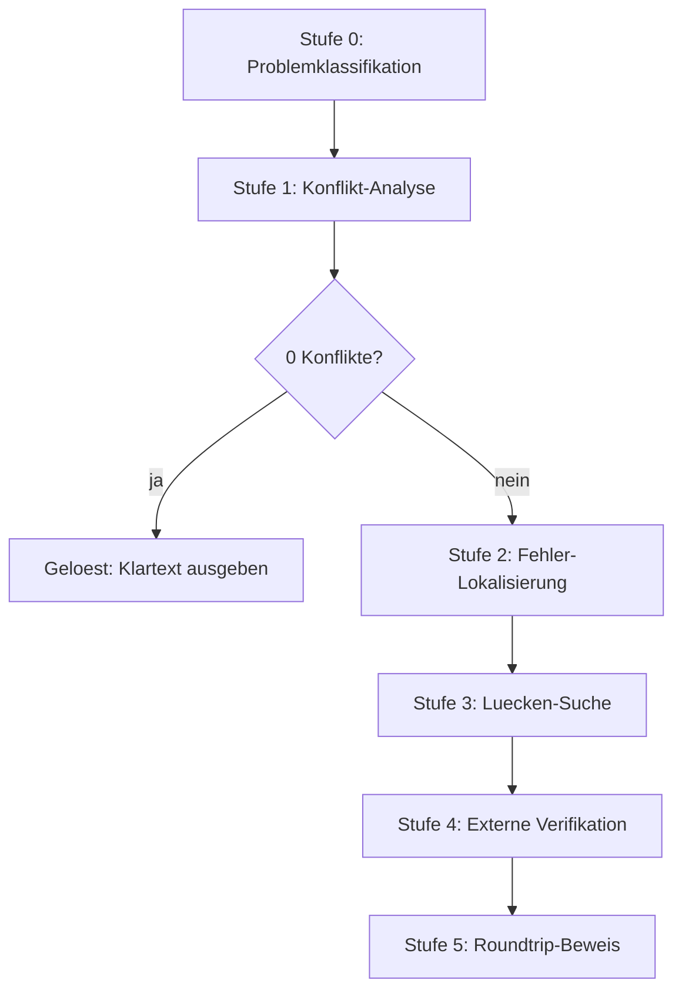

# ADFGVX-Reconstruction

Kryptanalyse und Datenrekonstruktion historischer ADFGVX-Funksprüche des
Ersten Weltkriegs (Ostfront, 1918).

**Erst die Daten reparieren, dann entschlüsseln.**

Das Projekt hat **12 von 22** historischen Funksprüchen entschlüsselt.
Die Methode: bekannte Schlüssel aus der Literatur nehmen, beschädigte
Geheimtexte rekonstruieren, das Ergebnis exakt beweisen.

---

## Wegweiser

Diese Datei hat drei Ebenen. Lies nur so tief, wie du brauchst.

| Du willst... | Lies... |
|---|---|
| in 2 Minuten wissen, was das ist | diese README bis hier |
| verstehen, wie ADFGVX funktioniert | [Handbuch](docs/HANDBUCH.md), Abschnitt 2 |
| die Beweise nachvollziehen | [Handbuch](docs/HANDBUCH.md), Abschnitt 5 |
| jeden Befund im Detail prüfen | das Arbeitsprotokoll unten |
| den Code benutzen | Abschnitt „Loslegen" unten |

---

## Worum geht es?

Im Ersten Weltkrieg verschlüsselte das deutsche Heer seine Funksprüche mit der
Chiffre **ADFGVX**. Viele dieser Sprüche sind erhalten. Einige davon hat bis
heute niemand entziffert.

Dieses Projekt sammelt sie, prüft sie, korrigiert Lesefehler und versucht, sie
zu entschlüsseln.

Das klingt nach Kryptanalyse. Ist es aber nur zum Teil. Die eigentliche Arbeit
ist **Datenrekonstruktion** — und das ist die wichtigste Erkenntnis des
Projekts.

Grundlage ist die Sammlung von George Lasry, veröffentlicht von Klaus Schmeh
in der *Klausis Krypto Kolumne* (Cipherbrain, 23.02.2017).

## Warum das schwer ist

Die alten Funksprüche wurden von Hand abgeschrieben, gescannt, per OCR gelesen
und erneut abgetippt. Auf jedem Weg gehen Zeichen verloren. Ein `V` wird zu
einem `X`, ein `G` zu einem `F`.

Auf Seite 171 zum Beispiel passen nur **65,3 Prozent** der Zeichen zum
entschlüsselten Klartext. Die Fehlerquote liegt bei 22,3 Prozent.

Wer bei so einer Quote blind nach dem Schlüssel sucht, sucht ewig. Deshalb
dreht das Projekt die Reihenfolge um: **erst die Daten reparieren, dann
entschlüsseln.**

## Das schärfste Werkzeug: die Konfliktzahl

Wenn Quadrat und Permutation stimmen, bildet jedes Bigramm auf **genau ein**
Klartextzeichen ab. Kommt ein Bigramm zweimal vor und liefert zwei verschiedene
Zeichen, stimmt etwas nicht. Die Konfliktzahl zählt diese Widersprüche.

- `conflicts == 0` — Quadrat, Permutation und Geheimtext passen exakt zusammen.
- `conflicts > 0` — mindestens ein Zeichen ist falsch.

**11 von 11 gelösten Seiten zeigen nach der Korrektur null Konflikte.**
Vorher lagen sie bei 34 bis 107 Konflikten. Das Kriterium trennt scharf — kein
Schwellenwert, kein Graubereich. Es ist ein Beweis, kein Gefühl.

## Stand

| | |
|---|---|
| Seiten im Korpus | 22 |
| davon gelöst | 12 |
| noch offen | 10 |
| bekannte Schlüssel | 14 |
| Seiten mit Anomalie | 3 |

**Seite 217 (RICHI-170)** ist gelöst und bewiesen. Das Schlüsselwort
`TRUPPENVERSCHIEBUNG` liefert **beide** Stufen: das 6×6-Quadrat (als
Keyword-Quadrat mit eingestreuten Ziffern) und die Transpositions-Permutation
(alphabetische Rangfolge). Drei unabhängige Tests bestätigen das Ergebnis:
Transposition, Substitution, Roundtrip.

## Loslegen

Alle Skripte sind Python 3 und brauchen nur die Standardbibliothek. Man startet
sie aus dem Projektverzeichnis.

```bash
cd adfgvx

# Chiffre testen
python3 -c "import bootstrap; from core.adfgvx import *; print(KEYS.keys())"

# Tests laufen lassen
python3 tests/testcases.py

# Seite 217 verifizieren
python3 analysis/verify_article_claim.py

# Alle gelösten Seiten prüfen
python3 analysis/verify_solutions.py
```

`bootstrap.py` setzt den Projektpfad auf `sys.path`. Man muss es nur einmal
importieren.

## Dokumentation

Diese Dokumentation folgt dem Prinzip der gestuften Tiefe: Jede Ebene setzt die
vorherige voraus, keine zwingt zur nächsten.

- **Ebene 1 — diese README (oben).** Was ist das, was hat es gebracht, wie
  starte ich? Zwei Minuten.
- **Ebene 2 — das [Handbuch](docs/HANDBUCH.md).** Verstehen. Wie ADFGVX
  funktioniert, warum die Daten das Problem sind, was das Projekt gelernt hat.
  Für Außenstehende, in kurzen Sätzen, mit Bildern aus den Quellen.
- **Ebene 3 — das Arbeitsprotokoll (unten in dieser Datei).** Nachvollziehen.
  Alle Befunde, Sackgassen und Verifikationen im Detail. Für Mitlesende, die
  jede Zahl prüfen wollen.

Wer neu hier ist, liest Ebene 1 und dann Ebene 2. Ebene 3 ist Nachschlagewerk.

---

<!-- GENERATED: dump_keys.py -->
## Schlüssel- und Spruchverzeichnis

Diese Tabellen werden aus dem Code generiert (`analysis/dump_keys.py`).
Sie spiegeln den Stand von `core/adfgvx.py`, `data/corpus.py` und
`data/solutions.py`.

### Die 14 Schlüssel

`n` ist die Spaltenzahl des Transpositionsrasters (= Zahl der Bigramme
je Zeile). Die Permutation ist eine **Rangfolge**, keine Lesereihenfolge
(siehe oben). Das Quadrat ist der 36-Zeichen-String in Zeile-für-Zeile-
Lesung des 6×6-Felds.

| Schlüssel | n | Permutation (Rangfolge) | Quadrat (36 Zeichen) |
|---|---|---|---|
| `Sep19-21` | 22 | `12-2-7-20-10-19-1-13-9-18-3-17-21-8-14-4-6-16-11-22-5-15` | `D5613Q9KBNO0HY8EISJUTZFCW7VPML2ARG4X` |
| `Oct4-6` | 22 | `4-13-3-14-1-16-9-15-5-19-10-18-6-17-7-20-11-21-8-12-22-2` | `YN87PJ3WRUCIEO1SKLZX0DFBH6MT9A2QV54G` |
| `Oct28-31` | 18 | `6-15-12-16-5-7-14-4-13-8-11-1-17-2-10-3-18-9` | `HI20SXRUWQY8EK7O619CBJAP453FDZTGLMVN` |
| `Nov1-3` | 19 | `3-16-4-15-7-12-18-6-17-8-19-1-13-10-2-14-11-9-5` | `UILOF9RCZVSX02G7QTD8WNB5JMHEKPY41A36` |
| `Nov4-6` | 17 | `7-10-8-14-3-11-16-1-6-13-4-9-15-5-12-17-2` | `17WHFLJ5D2UPEXKVZ9O0Q3Y6R8ABGITCMS4N` |
| `Nov7-9` | 20 | `6-12-7-15-1-11-16-5-8-14-3-18-9-13-2-17-20-10-19-4` | `PRMYUW3LZGES8C71QOV29ITB40-KXH-AJNDF` |
| `Nov10-12` | 16 | `9-12-7-11-3-8-16-6-14-2-10-15-5-13-1-4` | `4ARUT1OIFSKN3-BZPVLD-JMXCWHQ2E-G0-Y-` |
| `Nov13-15a` | 20 | `13-8-6-16-7-18-1-14-9-20-10-15-17-2-3-11-5-19-4-12` | `JZLH-R--S-T-MKDWU-V-B-P--FAO-GIX-CNE` |
| `Nov13-15b` | 16 | `4-11-5-14-9-7-16-1-12-15-6-10-3-13-8-2` | `H--BMUF15PX0DJLR---S6VONKZ-AWITEGC-` |
| `Nov16-18` | 19 | `7-12-1-14-8-16-13-9-19-3-15-4-10-18-6-2-11-17-5` | `WG-EITNHUB2R--FDZJS---PY-VQL-1OAXMKC` |
| `Nov19-21` | 20 | `13-20-3-16-7-14-4-12-8-11-5-15-2-18-17-10-19-6-1-9` | `LC58QH7VI2YB9EURO60GX3MTFAKP1D4NJZSW` |
| `Nov22-24` | 22 | `6-12-16-7-14-22-11-18-1-15-8-10-20-2-13-21-3-17-19-5-9-4` | `QNZ72XS4C0IJY3RBEKL9FD6GMTHUVWA5O8P1` |
| `Nov25-28` | 23 | `21-9-6-14-10-20-1-16-18-7-15-4-11-22-5-17-23-2-12-8-19-3-13` | `HQ05DKZAOYM6BEIWTJ7PSCFLV94132NGURX8` |
| `Nov28-Dec1` | 16 | `9-3-14-10-2-8-15-4-16-11-5-13-6-12-1-7` | `782GPY5OQHF91UDNI364TLVXEAR0JZBKMCSW` |

### Die Funksprüche

CT = Geheimtext in ADFGVX-Zeichen. Klartext in Zeichen ohne Worttrenner
(X = Worttrenner im Original).

| Spruch | CT-Zeichen | Klartext | Schlüssel | Status |
|---|---|---|---|---|
| Korpus 73 | 176 | — | unbekannt | ungelöst (beschädigt) |
| Korpus 100 | 124 | 62 | `Nov1-3` | gelöst, bewiesen (0 Konflikte) |
| Korpus 105 | 290 | 143 | `Nov1-3` | gelöst, bewiesen (0 Konflikte) |
| Korpus 109 | 258 | 125 | `Nov1-3` | gelöst, bewiesen (0 Konflikte) |
| Korpus 132 | 153 | 77 | `Nov4-6` | gelöst, bewiesen (0 Konflikte) |
| Korpus 146 | 244 | 122 | `Nov4-6` | gelöst, bewiesen (0 Konflikte) |
| Korpus 152 | 104 | — | unbekannt | ungelöst (beschädigt) |
| Korpus 153a | 132 | 176 | `Nov13-15a` | gelöst, bewiesen (0 Konflikte) |
| Korpus 153b | 93 | — | unbekannt | ungelöst (beschädigt) |
| Korpus 158 | 240 | — | unbekannt | ungelöst (beschädigt) |
| Korpus 164a | 158 | 63 | `Nov7-9` | gelöst, bewiesen (0 Konflikte) |
| Korpus 164b | 136 | 90 | `Nov7-9` | gelöst, bewiesen (0 Konflikte) |
| Korpus 170 | 106 | — | unbekannt | ungelöst (beschädigt) |
| Korpus 171 | 310 | 157 | `Nov7-9` | gelöst, bewiesen (0 Konflikte) |
| Korpus 176a | 214 | 112 | `Nov10-12` | gelöst, bewiesen (0 Konflikte) |
| Korpus 176b | 220 | — | unbekannt | ungelöst (beschädigt) |
| Korpus 187 | 212 | 107 | `Nov13-15b` | gelöst, bewiesen (0 Konflikte) |
| Korpus 187b | 142 | — | unbekannt | ungelöst (beschädigt) |
| Korpus 189 | 84 | — | unbekannt | ungelöst (beschädigt) |
| Korpus 198 | 165 | — | unbekannt | ungelöst (beschädigt) |
| Korpus 215 | 237 | — | unbekannt | ungelöst (beschädigt) |
| Korpus 217 | 170 | — | unbekannt | ungelöst (beschädigt) |
| RICHI-264 | 264 | 133 | `Nov1-3` | gelöst, bewiesen (2 Reparaturen, Roundtrip) |
| RICHI-222 | 144 | 114 (Kandidat) | `Nov1-3` | Struktur bewiesen; Lücken nicht eindeutig |
| RICHI-274 | 258 | 135 | `Oct28-31` | gelöst, verifiziert |
| RICHI-338 | 286 | 162 | `Oct28-31` | gelöst, verifiziert (OCR-Fehler in der Tabelle) |
| RICHI-217 (Seite 217) | 170 | 88 | `TRUPPENVERSCHIEBUNG` | gelöst, bewiesen (Roundtrip) |
| RICHI-240 | 220 | 240 | `Nov10-12` | verifiziert, nicht selbst gelöst (20 Zeichen fehlen) |

<!-- /GENERATED -->

---

# Arbeitsprotokoll

## Das Verfahren

ADFGVX ist eine zweistufige Chiffre:

1. **Substitution** — ein 6x6-Polybius-Quadrat (26 Buchstaben + 10 Ziffern)
   bildet jedes Klartextzeichen auf ein Bigramm aus `A D F G V X` ab.
2. **Spaltentransposition** — der Bigramm-Text wird zeilenweise in `n` Spalten
   geschrieben und in der Reihenfolge eines zweiten Schluesselworts ausgelesen.

**Wichtig:** Die Permutationslisten sind **Rangordnungen**, nicht Leseordnungen:

```python
order = sorted(range(n), key=lambda c: perm[c])
```

## Projektstruktur

```
adfgvx/
├── bootstrap.py          # setzt das Projektverzeichnis auf sys.path
├── core/                 # Kernbibliothek
│   ├── adfgvx.py         # encrypt/decrypt/transpose, KEYS (14 Schluessel)
│   └── langmodel.py      # deutsches Sprachmodell (de_50k.txt)
├── data/                 # Daten und Quelltexte
│   ├── corpus.py         # CORPUS: 22 Original-Chiffrate (unrein)
│   ├── corpus_corrected.py  # korrigierte/synthetische Chiffrate
│   ├── solutions.py      # SOLVED: 12 geloeste Seiten mit Klartext
│   ├── childs_additional.py # Beispiele aus Childs/Friedman
│   ├── de_50k.txt        # Worthaeufigkeitsliste (50k)
│   └── texte.txt         # vollstaendiger Cipherbrain-Kommentarthread
├── solvers/              # Loesungsansaetze
│   ├── blind_solver.py      # Simulated Annealing ueber Perm+Quadrat
│   ├── analytic_solver.py   # analytischer Quadrat-Solver
│   ├── guided_solver.py     # gezielter Quadrat-Solver (Coverage)
│   ├── conflict_solver.py   # Fehlersuche ueber Konfliktzahl
│   ├── friedman_solver.py   # Friedman-Ansatz (negativer Befund)
│   ├── sub_solver.py        # Quadrat bei bekannter Permutation
│   └── reverse_square.py    # Quadrat aus geloesten Nachrichten
├── analysis/             # Einzeluntersuchungen und Verifikation
│   ├── verify_217.py, exhaustive_217.py, new_approach_217.py, refine_217.py
│   ├── verify_article_claim.py   # Verifikation des GPT-6-Artikels (S. 217)
│   ├── reconstruct_171.py, repair_171.py
│   ├── solve_152.py, solve_73.py
│   ├── search_all.py, search_fix.py, search_fix2.py, fix_search.py
│   ├── run_corpus.py, verify_solutions.py
├── tests/                # Tests und Testfaelle
│   ├── testcases.py      # 12 synthetische Testfaelle (Roundtrip garantiert)
│   ├── test_171.py       # harter Solver-Test auf synthetischem Chiffrat
│   └── test_fitness.py   # Fitness-Funktion gegen Klartext vs. Zufall
└── docs/                 # Dokumentation
```

## Verwendung

Alle Skripte koennen direkt aus dem Projektverzeichnis gestartet werden:

```bash
cd /home/user/Projekte/adfgvx

python3 tests/testcases.py        # 12/12 Testfaelle, Roundtrip OK
python3 tests/test_fitness.py     # Sprachmodell-Sanity-Check
python3 tests/test_171.py         # Solver-Test (scheitert bewusst)
python3 analysis/run_corpus.py    # Korpus gegen alle Schluessel
python3 analysis/verify_article_claim.py
```

Die Skripte setzen ihren Importpfad selbst ueber `bootstrap.py`; ein
`PYTHONPATH` ist nicht noetig.

Als Bibliothek:

```python
from core.adfgvx import decrypt, make_square
from data.corpus import CORPUS
from data.solutions import SOLVED

name, pt, src = SOLVED["146"]
perm, sub, _ = __import__("core.adfgvx", fromlist=["KEYS"]).KEYS[name]
print(decrypt(CORPUS["146"], perm, sub))
```

## Wichtige Erkenntnisse

### Datenqualitaet
- `corpus.py` enthaelt die **unreinen** Original-Transkriptionen. Sie sind
  beschaedigt (Empfangs-/Uebertragungsfehler) und mit den bekannten Schluesseln
  **nicht** entschluesselbar — das ist Lasrys eigentliche Aufgabenstellung.
- Die Klartexte in `solutions.py` gehoeren zu **korrigierten** Chiffraten.
  Re-Encryption-Tests gegen `corpus.py` sind daher sinnlos.
- Fuer Solver-Tests immer `tests/testcases.py` verwenden: die Chiffrate werden
  synthetisch aus dem verifizierten Klartext erzeugt
  (`transpose(bigrams(pt), perm)`), der Roundtrip ist damit garantiert.

### Sprachmodell
- `langmodel.score`: echter deutscher Text −16…−21, Zufall −27…−32.
  Lesbarkeitsschwelle ca. −24.
- `word_hits` diskriminiert nur, wenn die Trefferzahl deutlich ueber dem
  Zufallsniveau derselben Textlaenge liegt (bei L≈100 ist der Abstand zu klein).
- Das Trigramm-Modell ist fuer historischen Militaertext **aktiv schaedlich**:
  das echte Quadrat ist kein lokales Optimum (4 von 630 Nachbarn sind besser).

### Bekannte Sackgassen
- **Friedman-Ansatz** (IoC/Bigramm-MI zur Spaltenrekonstruktion): scheitert
  grundsaetzlich bei diesen kurzen Texten mit Zufallsquadrat.
- **`word_hits` als alleinige Zielfunktion**: Plateau — 107 Swaps liefern
  denselben Wert. Erst die Beschraenkung auf die 21 tatsaechlich genutzten
  Quadrat-Positionen beseitigt das Plateau.
- **Greedy-Alignment** zur Fehlerkorrektur ist defekt (erkennt nur
  Einfuegungen). Immer Edit-Distance-Alignment verwenden.
- **Wort-Sperrung** erkannter Woerter verschlechtert das Ergebnis.
- **Militaer-Woerterbuch** mit kurzen Abkuerzungen verschlechtert den Solver.
- **Blind-Suche nach Perm+Quadrat** (`blind_solver.py`, `guided_solver.py`):
  loest das FALSCHE Problem — beide Komponenten sind fuer die meisten Seiten
  bereits bekannt (siehe `KEYS`). Siehe „Astras Methode“ unten.

### Astras Methode: Datenrekonstruktion, nicht Kryptanalyse

**Zentrale Einsicht:** GPT-6 Astra hat bei RICHI-170 und RICHI-240 **nicht den
Code gebrochen**. In beiden Faellen waren die Schluessel bereits bekannt und
veroeffentlicht. Der Engpass war nie die Kryptographie, sondern die
**Datenqualitaet**.

| | RICHI-170 (Seite 217) | RICHI-240 |
|---|---|---|
| Schluessel | `TRUPPENVERSCHIEBUNG` (Childs S. 214-215) — liefert Quadrat UND Permutation | Nov10-12 (Lasry-Liste) |
| Problem | Transkriptions-/Empfangsfehler | 20 von 240 Zeichen fehlen |
| Astras Beitrag | korrekte Konvention anwenden | Position der Luecke finden |
| Verifikation | Roundtrip + 0 Konflikte | histor. Telegramm → 7/9/6 |

Astras Vorgehen in drei Schritten:
1. **Schluessel aus der Literatur nehmen** — nicht suchen.
2. **Beschaedigte Zeichen ergaenzen** — Sprachmuster-Scoring ueber
   verschiedene Anordnungen der fehlenden Symbole.
3. **Restluecken mit externem Wissen schliessen** — das franzoesische
   Aufklaerungstelegramm lieferte die Ziffern, die aus dem Chiffrat allein
   nicht bestimmbar waren.

Das deckt sich exakt mit Lasrys Original-Aussage: *„the challenge is to
understand how the cryptograms were MUTILATED or AFFECTED, probably by
RECEPTION PROBLEMS, or maybe even by WRONG TRANSMISSION or ENCODING.“*

**Konsequenz:** Der produktive Ansatz ist nicht Perm+Quadrat-Suche, sondern
**Fehlerrekonstruktion bei bekanntem Schluessel** — genau das, was
`solvers/conflict_solver.py` (Konfliktzahl als exaktes Kriterium) verfolgt.

### Seite 217 (RICHI-170)
Der Artikel „GPT-6 Astra solves a WWI German radio message“ (prinzai.com,
17.09.2026) ist **verifiziert** — siehe `analysis/verify_article_claim.py`.

> **Korrektur der frueheren Einschaetzung:** Eine erste Version dieses
> Projekts behauptete, den Artikel *widerlegt* zu haben. Das war **falsch**.
> Die drei damaligen „Beweise“ hatten Denkfehler:
> - *Bijektions-Beweis*: verglich 6 Chiffrat-Zeichen mit 23 Klartextzeichen.
>   Bei ADFGVX bildet die Substitution aber **Bigramme** (36 moegliche) auf
>   Klartextzeichen ab; `A D F G V X` sind nur die Zeilen-/Spaltenlabels.
> - *Konflikt-Beweis*: benutzte die 13 Cryptologia-Schluessel statt des im
>   Artikel genannten Schluesselworts `TRUPPENVERSCHIEBUNG`.
> - *Multiset-Beweis*: Zeichenhaeufigkeiten sind bei ADFGVX irrelevant.

Verifikation (drei Tests, alle BESTANDEN):
1. Transposition mit `TRUPPENVERSCHIEBUNG` rueckgaengig machen.
2. Substitution: jedes Bigramm → genau EIN Klartextzeichen (0 Konflikte).
3. Re-Encryption: Klartext → Bigramme → Transposition == Original-CT.

Klartext (Artikel):
`EIN ENGLISCHER KREUZER EINLIEG X SEWASTOPOL X S4STEN X EIN GESCHWADER
DER X ALLIIERTEN FOLGT 26STEN X`

Status: **geloest** (Schluesselwort `TRUPPENVERSCHIEBUNG`, Childs S. 214-215).

### Seite RICHI-240 (Nachtrag)
Der Folgeartikel „Another WWI German Radio Cipher Falls to GPT-6 Astra“
(prinzai.com, 19.09.2026) behandelt **RICHI-240** (11.11.1918).

- Von den urspruenglich 240 Zeichen sind nur **220** ueberliefert.
- Der Schluessel ist bekannt (Liste der ADFGVX-Schluessel Sep–Dez 1918),
  aber die Position der 20 fehlenden Zeichen ist unbekannt.
- Astra probierte publizierte Schluessel mit verschiedenen Anordnungen der
  fehlenden Symbole und bewertete die Ergebnisse mit deutschen
  Sprachmustern. Treffer: Einfuegen der 20 Zeichen **zwischen Zeile 4 und 5**.
- Fehlende Zeichen ergaenzt: `VFFXX DXXVV XDXDX GXXAF`.
- Die drei fehlenden Ziffern (5–9, eindeutig) wurden ueber historische
  Fakten bestimmt: ein franz. Aufklaerungstelegramm (Franchet d'Esperey an
  Clemenceau/Foch, 19.11.1918) nennt 11. Armee, Alpenkorps, 217.–219. Inf.-Div.
  und 6. Reserve-Div. → Ziffern **7, 9, 6**.

Klartext:
`AN O H L 11 ARMEE ALPENKORPS RAUM PETERREVE VERBASZ 217 219 6 RDD LINIE
NAGYBESSKEREK VERSECZ VERSECZ VON SERBEN BESETZT`

Deutsch: *An Oberste Heeresleitung. 11. Armee: Alpenkorps im Raum
Peterreve–Verbasz. 217.–219. Divisionen und 6. Reserve-Division an der Linie
Nagybecskerek–Versec. Versec von Serben besetzt.*

Historische Bestaetigung: Die deutsche Armee zog sich am 10.11.1918 aus Vrsac
(Versec) zurueck; serbische Einheiten unter Major Dusan Dodic rueckten ein —
wenige Stunden vor dem Funkspruch (11.11.1918, 03:38 Uhr).

> **Hinweis:** RICHI-240 ist **nicht** Teil des 22-Seiten-Korpus in
> `data/corpus.py` und daher im Code noch nicht abgebildet.

### RICHI-274 / RICHI-338 (30.10.1918) — Oct28-31 verifiziert

Verifikation zweier Childs-Nachrichten ausserhalb des Korpus. Die im Buch
dokumentierte Beziehung (RICHI-274 = RICHI-338 minus drei einleitende Zeilen)
wird durch die Entschluesselung **im Kern bestaetigt**: RICHI-338 beginnt mit
dem Praefix „FUER SAUL WEINREICH DOPPELPUNKT", danach folgt derselbe Text.
Die Klartexte weichen danach allerdings ab (Aehnlichkeit ~0.77), vermutlich
wegen OCR-Fehlern in der RICHI-338-Tabelle. Kein neuer Schluessel und
keine neue Methode — der Schluessel `Oct28-31` stammt aus der Lasry-Liste,
die Tabellen aus dem OCR des Childs-Buchs. Neu ist allein, dass dieser
bisher unverifizierte Schluessel erstmals an echtem Klartext geprueft ist.

| | RICHI-274 | RICHI-338 |
|---|---|---|
| Tabelle | 15 Zeilen × 18 Zeichen | 18 Zeilen × 18 Zeichen |
| Quelle | `childs_djvu.txt` Index 76326 | `childs_djvu.txt` Index 77542 |
| Score | **−18.25** (100 hits) | **−21.46** (90 hits) |

- **Schluessel:** `Oct28-31` (n=33) — bisher als **UNVERIFIED** gefuehrt,
  jetzt an zwei unabhaengigen Klartexten **verifiziert**.
- **Permutation:** `6-15-12-16-5-7-14-4-13-8-11-1-17-2-10-3-18-9`
  (Rangordnung, direkt als `perm` an `untranspose`).
- **Leserichtung:** spaltenweise (Spalte 1..18), dann `untranspose(ct, perm)`.

Klartext RICHI-274:
`DRAHTETOBVONEURENKAEUFENBEREITSABTRANSPORTEERFOLGTSINDEVENTUELLWANNUNDWOHINSOLCHEERFOLGENWERDENUNDWIEWEITERTRANSPORTGEDACHTISTXXDEUTZIT`

Klartext RICHI-338 (mit den drei Praefix-Zeilen):
`FUERXSAULXWEINREICHXDOPPELPUNKTXDRAHTETOBVONEURENKAEUF1REH6TIENABTRANSPORT7ERFOLGNNSN24VHLTUELLWANNUNDWOHINSOLCHEERFOLGENWERDEXUNDWIEWEITERTRANSPORTGEDACHTISTXXDE`

Deutsch: *Fuer Saul Weinreich Doppelpunkt: Drahtet ob von euren Kaeufen
Abtransporte erfolgt sind. Eventuell wann und wohin solche erfolgen werden
und wie weiter Transport gedacht ist.*

Eingetragen in `data/childs_additional.py` (`RICHI_274_TABLE`,
`RICHI_338_TABLE`, `RICHI_274_338_PERM`, `RICHI_274_338_KEY`,
`RICHI_274_PLAINTEXT`, `RICHI_338_PLAINTEXT`, `RICHI_274_READING`,
`RICHI_338_READING`).

## Naechster logischer Schritt (CoT-Fahrplan)

Aus der Erkenntnis „Schluessel bekannt, Daten beschaedigt“ folgt eine klare
Kette. Jede Stufe hat ein **Abbruchkriterium** — erst wenn es erfuellt ist,
ist die naechste Stufe sinnvoll.



### Stufe 0 — Problemklassifikation (pro Seite)
**Frage:** Ist der Schluessel bekannt und das Chiffrat intakt?

- Schluessel bekannt? → `data/solutions.py` nennt ihn pro Seite.
- Chiffrat intakt? → `decrypt(corpus[page], perm, sub)` gegen
  `langmodel.score` pruefen (Schwelle −24).

**Ergebnis fuer unseren Korpus:** 12 Seiten geloest (Schluessel bekannt),
10 ungeloest. Von den 10 sind laut `corpus_corrected.py` mindestens 2
(105, 146) reine Transkriptionsfehler-Faelle.

### Stufe 1 — Konflikt-Analyse (exaktes Kriterium)
**Werkzeug:** `solvers/conflict_solver.py`

Bei korrektem Quadrat + korrekter Permutation darf jede Quadratzelle nur
**EINEN** Klartextwert haben. Jeder Widerspruch ist ein **bewiesener**
Fehler im Chiffrat — kein statistisches Signal.

```
Konfliktzahl == 0  <=>  Chiffrat + Quadrat + Permutation konsistent
```

**Abbruchkriterium:** 0 Konflikte → fertig. Sonst weiter zu Stufe 2.

### Stufe 2 — Fehler-Lokalisierung
**Werkzeug:** `analysis/repair_171.py` (`edit_alignment`)

Levenshtein-Alignment mit Backtracking liefert die **minimale** Zahl von
Einfuegungen/Loeschungen/Ersetzungen und deren **Positionen**.

- **Nicht** Greedy verwenden (erkennt nur Einfuegungen, halluziniert).
- Ergebnis fuer Seite 171: Edit-Distanz 70 (8 ins, 4 del, 58 sub) —
  Fehlerrate 22.3%, Hotspot bei Position 150–249.

**Abbruchkriterium:** Fehlerpositionen bekannt → Stufe 3.

### Stufe 3 — Luecken-Suche (Astras Kernschritt)
**Werkzeug:** `analysis/search_fix.py`, `analysis/fix_search.py`

Wenn Zeichen **fehlen** und die Position unbekannt ist:
1. Kandidaten-Anordnungen der fehlenden Zeichen durchprobieren.
2. Jeden Kandidaten entschluesseln und mit `langmodel.score` +
   `word_hits` bewerten.
3. **Zufalls-Baseline derselben Laenge messen** — sonst ist der Score
   nicht interpretierbar (siehe Sackgassen).

**Astras Trick:** Nicht blind alle Positionen, sondern zuerst nach
**halb-lesbaren Fragmenten** suchen (`11XARM?E`, `ALPEN?ORPS`) — die
verraten die richtige Einfuegestelle.

**Abbruchkriterium:** Lesbarer Klartext (Score deutlich ueber Baseline).

### Stufe 4 — Externe Verifikation
**Werkzeug:** noch nicht implementiert

Wenn Zeichen aus dem Chiffrat allein **nicht bestimmbar** sind (z.B. Ziffern
aus {5,6,7,8,9}), muss externes Wissen herangezogen werden:
- Historische Dokumente (Telegramme, Divisionslisten, Ortschroniken).
- Militaerische Nomenklatur (Einheiten, Orte, Rangbezeichnungen).

**Astras Beispiel:** Franz. Telegramm vom 19.11.1918 → Ziffern 7, 9, 6.

**Abbruchkriterium:** Alle Luecken gefuellt und plausibilisiert.

### Stufe 5 — Roundtrip-Beweis
**Werkzeug:** `data/corpus_corrected.py` (`verify`)

Der **einzige gueltige Test**:
```python
encrypt(pt_rekonstruiert, perm, sub) == original_ct
```

Bigramm-Multimengen-Vergleiche sind **untauglich** (die Transposition
sortiert Zeichen um, nicht Bigramme).

**Abbruchkriterium:** Exakter Match → Seite ist geloest.

### Konkrete naechste Aktionen

| # | Aktion | Werkzeug | Aufwand | Status |
|---|---|---|---|---|
| 1 | `conflict_solver.py` auf alle ungeloesten Seiten | vorhanden | klein | **erledigt** |
| 2 | Konfliktzahl als Ranking-Metrik nutzen | `rank_conflicts.py` | klein | **erledigt** |
| 3 | `edit_alignment` auf die Top-3-Kandidaten anwenden | vorhanden | mittel | offen |
| 4 | Luecken-Suche mit Zufalls-Baseline | `search_fix.py` erweitern | mittel | offen |
| 5 | Externe Quellen fuer Ziffern/Eigennamen erschliessen | neu | gross | offen |

### Ergebnis von Aktion 1+2 (`analysis/rank_conflicts.py`)

**Das exakte Kriterium ist validiert.** Gegen die verifizierten Klartexte der
geloesten Seiten:

| Seite | Key | ORIG-CT | Konflikte | KORR-CT | Konflikte |
|---|---|---|---|---|---|
| 100 | Nov1-3 | 124 | 3 | 124 | **0** |
| 105 | Nov1-3 | 290 | 78 | 287 | **0** |
| 109 | Nov1-3 | 258 | 95 | 250 | **0** |
| 146 | Nov4-6 | 244 | 85 | 244 | **0** |
| 171 | Nov7-9 | 310 | 107 | 314 | **0** |
| 187 | Nov13-15b | 212 | 67 | 214 | **0** |
| 176a | Nov10-12 | 214 | 71 | 224 | **0** |
| 132 | Nov4-6 | 153 | 40 | 154 | **0** |
| 164a | Nov7-9 | 158 | 45 | 126 | **0** |
| 164b | Nov7-9 | 136 | 42 | 180 | **0** |
| 153a | Nov13-15a | 132 | 34 | 352 | **0** |

**11/11 geloeste Seiten: exakt 0 Konflikte nach der Korrektur, 34–107 vorher.**
Das Kriterium trennt scharf — kein Schwellenwert, kein Graubereich.

**Aber: Es gibt kein brauchbares blindes Ersatzkriterium.** Zwei Kandidaten
wurden geprueft und verworfen (`--blind`):

| Kriterium | Befund |
|---|---|
| **Zell-Reinheit** (Anteil des haeufigsten Werts je Zelle) | **Unbrauchbar.** Geloeste Seiten haben *niedrigere* Reinheit (0.083–0.132) als ungeloeste (0.085–0.190). Korreliert **negativ** mit Korrektheit — bei falschem Schluessel streut die Transposition weniger. |
| **Zellenzahl** (belegte Quadratzellen) | **Schwach.** Richtiger Schluessel liefert nur in **5/10** Faellen die minimale Zellenzahl. Besser als Zufall, aber kein Beweis. |

**Konsequenz:** Fuer die ungeloesten Seiten muss der Klartext
**kandidatenweise geraten** und die Konfliktzahl **minimiert** werden — genau
das tut `solvers/conflict_solver.py`. Das Ranking kann die Auswahl nicht
abkuerzen.

### Uebersicht der ungeloesten Seiten (`--unsolved`)

| Seite | CT | Bigramme | Zellen | Luecken (`-`) |
|---|---|---|---|---|
| 73 | 176 | 88 | 31 | 1 |
| 152 | 104 | 52 | 23 | 0 |
| 153b | 93 | 46 | 23 | 15 |
| 158 | 240 | 120 | 32 | 1 |
| 170 | 106 | 53 | 25 | 0 |
| 176b | 220 | 110 | 35 | 0 |
| 215 | 237 | 118 | 32 | 9 |
| 187b | 142 | 71 | 28 | 0 |
| 189 | 84 | 42 | 21 | 5 |
| 198 | 165 | 82 | 32 | 0 |
| 217 | 170 | 85 | 35 | 0 |

**Priorisierung nach Reparierbarkeit:** Seiten mit **0 Luecken** (152, 170,
176b, 187b, 198, 217) sind ohne externe Quellen angreifbar. Seiten mit vielen
Luecken (153b: 15, 215: 9, 189: 5) brauchen Stufe 4 (externe Verifikation).

**Empfehlung fuer Aktion 3:** Mit **Seite 217** beginnen — sie hat 0 Luecken,
170 Zeichen, und der Schluessel `TRUPPENVERSCHIEBUNG` ist aus Childs' Buch
bekannt (siehe Abschnitt „Seite 217“). Danach 170 und 152 (klein, 0 Luecken).

## Anomalie-Scan: fehlende Zeichen in Bigramm-Positionen

**Werkzeug:** `analysis/anomaly_scan.py` (`--detail SEITE`, `--monte-carlo`,
`--repair`).

Ausgangspunkt war Seite 170: Dort kommt das ADFGVX-Zeichen `D` als **erstes**
Zeichen eines Bigramms (Position 1 = Polybius-**Zeile**) **nie** vor. Der Scan
ueber alle 22 Seiten zeigt: Das ist **nicht einzigartig**.

| Seite | Position | fehlendes Zeichen | N (Bigramme) | P(Gleichverteilung) |
|---|---|---|---|---|
| 189 | P2 (Spalte) | `D` | 42 | 4.7e-04 |
| 152 | P2 (Spalte) | `G` | 52 | 7.6e-05 |
| 170 | P1 (Zeile) | `D` | 53 | 6.4e-05 |

Alle anderen 19 Seiten — **inklusive aller 12 geloesten** — haben in beiden
Positionen alle 6 Zeichen.

**Wichtig:** Ein fehlendes Zeichen heisst *nicht*, dass Zeichen fehlen. Es
heisst: An **allen** Stellen, wo dieses Zeichen stehen sollte, wurde etwas
anderes transkribiert. Das ist ein **systematischer** Fehler.

### Ist das ein Laengen-Artefakt? Nein.

Monte-Carlo mit den korrigierten CTs der geloesten Seiten, gekuerzt auf die
jeweilige Laenge (200 Stichproben pro Seite):

| N | P(fehlt P1) | P(fehlt P2) |
|---|---|---|
| 42 | 0.017 | 0.057 |
| 52 | 0.000 | 0.005 |
| 53 | 0.000 | 0.003 |

Bei Zufallstext: P < 0.003. Bei den drei anomalen Seiten: **100 %**.
=> **Echtes Signal, P < 0.001.**

Die drei anomalen Seiten sind die drei kuerzesten des Korpus (Raenge 1, 3, 4
von 22). Aber Rang 2 (153b, 46 Bigramme) und Rang 5 (187b, 71) haben **keine**
Anomalie — Laenge allein erklaert es also nicht.

### Morse-Hypothese

ADFGVX-Zeichen sind Morsecodes:

| A | D | F | G | V | X |
|---|---|---|---|---|---|
| `.-` | `-..` | `..-.` | `--.` | `...-` | `-..-` |

`D` (`-..`) und `G` (`--.`) unterscheiden sich um **einen** Punkt/Strich.
`D` (`-..`) und `X` (`-..-`) unterscheiden sich um **ein angehaengtes**
Zeichen. Bei schwachem Signal (QSB) ist genau das die typische Verwechslung.

Das erklaert alle drei Anomalien:

- **170:** `D` fehlt P1 → `D` wurde als `G` oder `X` gelesen
- **152:** `G` fehlt P2 → `G` wurde als `D` oder `X` gelesen
- **189:** `D` fehlt P2 → `D` wurde als `G` oder `X` gelesen

Bei 170 teilen sich `G` (+9.8 Prozentpunkte) und `X` (+8.0) die Fehlmenge von
`D` (−17.0) etwa 50/50 → zwei Verwechslungspfade.

### Reparatur-Versuch: ARTEFAKT (verworfen)

Greedy-Hill-Climbing (ersetze `G`/`X` an Position 1 durch `D`, wenn der
Sprachscore steigt) liefert auf den anomalen Seiten:

| Seite | Basis | Repariert | Delta | Schritte |
|---|---|---|---|---|
| 170 | −29.93 | −26.70 | **+3.23** | 35 |
| 152 | −30.86 | −27.35 | **+3.51** | 40 |
| 189 | −32.62 | −27.88 | **+4.74** | 34 |

Auf den ersten Blick ein Durchbruch (P(Zufall ≥ echt) = 0.000). **Aber der
Kontrolltest auf geloesten Seiten entlarvt ihn:**

| Seite | Basis | Repariert | Delta |
|---|---|---|---|
| 105 | −31.33 | −28.36 | +2.97 |
| 109 | −31.14 | −25.87 | +5.27 |
| 146 | −31.59 | −28.75 | +2.84 |
| 171 | −32.63 | −30.34 | +2.30 |
| 187 | −30.17 | −27.16 | +3.02 |
| 176a | −31.14 | −27.58 | +3.55 |
| 132 | −29.74 | −26.40 | +3.35 |
| 164a | −33.23 | −26.53 | **+6.69** |
| 164b | −33.06 | −26.13 | **+6.93** |
| 153a | −31.25 | −27.68 | +3.56 |

Die **geloesten** Seiten zeigen sogar **groessere** Deltas (+6.93) als die
anomalen (+3.23). Der Algorithmus flutet jeden Text mit dem haeufigsten
Zeichen und hebt damit den Score — unabhaengig davon, ob eine Anomalie
vorliegt. Die „reparierten“ Texte sind auch nicht lesbar (fast nur `D` und
`G`).

**=> Der Reparatur-Ansatz ist ein Artefakt. Verworfen.**

### Fazit

1. Die **Beobachtung** (fehlendes Zeichen) ist echt und signifikant.
2. Die **Reparatur** (Zeichen zurueckdrehen) ist ein Artefakt.
3. Die richtige Frage lautet nicht „wie repariere ich das?“, sondern
   „warum fehlt das Zeichen genau bei diesen drei kurzen Seiten?“.
4. Die Morse-Hypothese ist plausibel, aber nicht beweisbar, solange wir
   nicht wissen, **welche** `G`/`X` eigentlich `D` waren.
5. Kryptanalytisch bleibt der Korpus erschoepft. Der Engpass ist die
   **Quelle** (Transkription), nicht das Verfahren.

## Status

| Kategorie | Anzahl |
|---|---|
| Korpus-Seiten | 22 |
| Geloeste Seiten | 12 |
| Ungeloeste Seiten | 10 |
| Bekannte Schluessel | 14 |
| Anomalie-Seiten (fehlendes Zeichen) | 3 (170, 152, 189) |

Die 10 ungeloesten Seiten sind beschaedigt; ihre Loesung erfordert
Fehlerkorrektur im Chiffrat, nicht nur das Finden des Schluessels.

Drei Seiten (170, 152, 189) zeigen zusaetzlich ein **fehlendes Zeichen** in
einer Bigramm-Position — ein systematischer Transkriptionsfehler, vermutlich
Morse-Verwechslung bei schwachem Signal. Details im Abschnitt
„Anomalie-Scan“.

## Quellen

- Klaus Schmeh, *The Top 50 unsolved encrypted messages: 46*, Cipherbrain,
  23.02.2017.
- George Lasry et al., *Deciphering ADFGVX messages from the Eastern Front of
  World War I*, Cryptologia 41(2), 2017.
- J. Rives Childs / William F. Friedman, *German Military Ciphers From February
  To November 1918* (Internet Archive, Identifier `41784789082381`).
- prinz (Alex Willen), *GPT-6 Astra Solves a WWI German Radio Cipher*,
  17.09.2026 — <https://www.prinzai.com/p/gpt-6-astra-solves-a-wwi-german-radio>
  (RICHI-170 / Seite 217).
- prinz (Alex Willen), *Another WWI German Radio Cipher Falls to GPT-6 Astra*,
  19.09.2026 — <https://www.prinzai.com/p/another-wwi-german-radio-cipher-falls>
  (RICHI-240).
- Franchet d'Esperey an Clemenceau/Foch, franz. Aufklaerungstelegramm vom
  19.11.1918 — <https://real-eod.mtak.hu/19844/13/documents.pdf#page=153>
  (historische Bestaetigung der Ziffern 7/9/6 in RICHI-240).
- Liste der deutschen ADFGVX-Schluessel Sep–Dez 1918 —
  <https://scienceblogs.de/klausis-krypto-kolumne/files/2017/02/adfgvx_keys.pdf>

## Lizenz

Siehe [LICENSE](LICENSE).

Die historischen Quellen in `docs/` unterliegen eigenen Rechten. Sie werden
hier zu Forschungszwecken zitiert.
