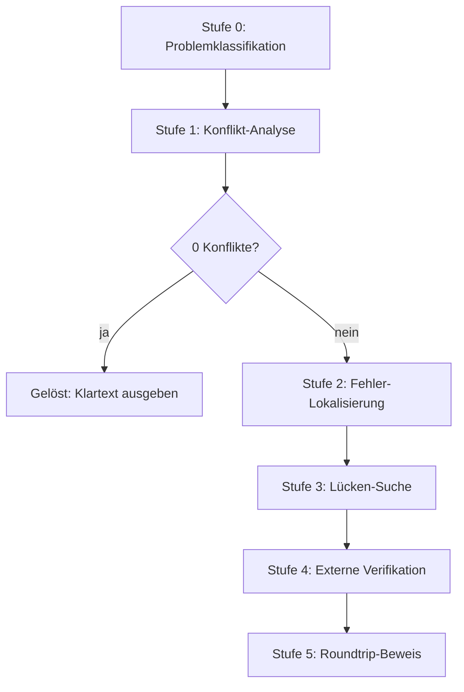

# ADFGVX-Reconstruction

Kryptanalyse und Datenrekonstruktion historischer ADFGVX-Funksprüche des
Ersten Weltkriegs (Ostfront, 1918).

**Erst die Daten reparieren, dann entschlüsseln.**

Das Projekt hat **12 von 22** Korpus-Funksprüchen entschlüsselt — plus vier
Nachrichten aus dem Childs-Buch, die außerhalb des Korpus liegen.
Die Methode: bekannte Schlüssel aus der Literatur nehmen, beschädigte
Geheimtexte rekonstruieren, das Ergebnis exakt beweisen.

---

## Wegweiser

Diese Datei hat drei Ebenen. Lies nur so tief, wie du brauchst.

| Du willst... | Lies... |
|---|---|
| in 2 Minuten wissen, was das ist | diese README bis hier |
| verstehen, wie ADFGVX funktioniert | [Handbuch](docs/HANDBUCH.md), Abschnitt 2 |
| die Beweise nachvollziehen | [Handbuch](docs/HANDBUCH.md), Abschnitt 5 |
| Schlüssel und Sprüche nachschlagen | das Verzeichnis unten |
| jeden Befund im Detail prüfen | das Arbeitsprotokoll unten |
| den Code benutzen | Abschnitt „Loslegen" unten |

---

## Worum geht es?

Im Ersten Weltkrieg verschlüsselte das deutsche Heer seine Funksprüche mit der
Chiffre **ADFGVX**. Viele dieser Sprüche sind erhalten. Einige davon hat bis
heute niemand entziffert.

Dieses Projekt sammelt sie, prüft sie, korrigiert Lesefehler und entschlüsselt
sie.

Das klingt nach Kryptanalyse. Ist es aber nur zum Teil. Die eigentliche Arbeit
ist **Datenrekonstruktion** — und das ist die wichtigste Erkenntnis des
Projekts.

Grundlage ist die Sammlung von George Lasry, veröffentlicht von Klaus Schmeh
in der *Klausis Krypto Kolumne* (Cipherbrain, 23.02.2017).

## Warum das schwer ist

Die alten Funksprüche wurden von Hand abgeschrieben, gescannt, per OCR gelesen
und erneut abgetippt. Auf jedem Weg gehen Zeichen verloren. Ein `V` wird zu
einem `X`, ein `G` zu einem `F`.

Auf Seite 171 zum Beispiel passen nur **65,3 Prozent** der Zeichen zum
entschlüsselten Klartext. Die Fehlerquote liegt bei 22,3 Prozent.

Wer bei so einer Quote blind nach dem Schlüssel sucht, sucht ewig. Deshalb
dreht das Projekt die Reihenfolge um: **erst die Daten reparieren, dann
entschlüsseln.**

## Das schärfste Werkzeug: die Konfliktzahl

Wenn Quadrat und Permutation stimmen, bildet jedes Bigramm auf **genau ein**
Klartextzeichen ab. Kommt ein Bigramm zweimal vor und liefert zwei verschiedene
Zeichen, stimmt etwas nicht. Die Konfliktzahl zählt diese Widersprüche.

- `conflicts == 0` — Quadrat, Permutation und Geheimtext passen exakt zusammen.
- `conflicts > 0` — mindestens ein Zeichen ist falsch.

**Alle 11 geprüften Korpus-Seiten zeigen nach der Korrektur null Konflikte.**
Vorher lagen sie bei 34 bis 107 Konflikten. Das Kriterium trennt scharf — kein
Schwellenwert, kein Graubereich.

> **Wichtig — was die Konfliktzahl beweist und was nicht.** Die Konfliktzahl
> ist nur dann ein *Beweis*, wenn sie gegen ein **unabhängig überliefertes**
> Chiffrat geprüft wird. Das trifft auf die Seiten **100**, **105** und **146**
> zu (echte Transkription aus `corpus.py` bzw. dem Kommentarthread). Für die
> übrigen gelösten Seiten wurde der Geheimtext aus dem Klartext
> **rekonstruiert** (`transpose(bigrams(pt), perm)`) — dort ist der Roundtrip
> per Konstruktion garantiert und die Konfliktzahl 0 trivial. Siehe
> „Evidenzlage" unten.

## Stand

| | |
|---|---|
| Seiten im Korpus | 22 |
| davon gelöst | 12 |
| davon unabhängig belegt | 3 (100, 105, 146) |
| noch offen | 10 |
| bekannte Schlüssel | 14 |
| Seiten mit Anomalie | 3 |
| Childs-Nachrichten außerhalb | 4 (264, 222, 274, 338) |

Die Headline-Ergebnisse:

- **Seite 217 (RICHI-170)** — gelöst und bewiesen. Das Schlüsselwort
  `TRUPPENVERSCHIEBUNG` liefert **beide** Stufen: das 6×6-Quadrat (als
  Keyword-Quadrat mit eingestreuten Ziffern) und die Transpositions-Permutation.
- **RICHI-264** — gelöst und bewiesen (2 Reparaturen, exakter Roundtrip).
- **RICHI-222** — Struktur bewiesen; die Lückenfüllung ist nicht eindeutig.
- **RICHI-274 / RICHI-338** — verifiziert am Schlüssel `Oct28-31`.
- **RICHI-240** — verifiziert, aber nicht von diesem Projekt gelöst.

> **Zur Ehrlichkeit der Zahlen.** Von den 12 gelösten Korpus-Seiten sind nur
> **3** (100, 105, 146) gegen ein unabhängig überliefertes Chiffrat geprüft.
> Bei den übrigen 9 wurde der Geheimtext aus dem Klartext rekonstruiert — der
> Beweis ist dort zirkulär. Die externen Beweise (217, RICHI-264/274/338,
> RICHI-222) sind davon nicht betroffen. Details: „Evidenzlage der gelösten
> Seiten".

## Loslegen

Alle Skripte sind Python 3 und brauchen nur die Standardbibliothek. Man startet
sie aus dem Projektverzeichnis.

```bash
cd adfgvx

# Chiffre testen
python3 -c "import bootstrap; from core.adfgvx import *; print(KEYS.keys())"

# Tests laufen lassen
python3 tests/testcases.py

# Seite 217 verifizieren
python3 analysis/verify_article_claim.py

# Alle gelösten Seiten prüfen
python3 analysis/verify_solutions.py

# Konfliktzahl als Kriterium belegen
python3 analysis/rank_conflicts.py
```

`bootstrap.py` setzt den Projektpfad auf `sys.path`. Man muss es nur einmal
importieren.

## Dokumentation

Diese Dokumentation folgt dem Prinzip der gestuften Tiefe: Jede Ebene setzt die
vorherige voraus, keine zwingt zur nächsten.

- **Ebene 1 — diese README (oben).** Was ist das, was hat es gebracht, wie
  starte ich? Zwei Minuten.
- **Ebene 2 — das [Handbuch](docs/HANDBUCH.md).** Verstehen. Wie ADFGVX
  funktioniert, warum die Daten das Problem sind, was das Projekt gelernt hat.
  Für Außenstehende, in kurzen Sätzen, mit Bildern aus den Quellen.
- **Ebene 3 — das Arbeitsprotokoll (unten in dieser Datei).** Nachvollziehen.
  Alle Befunde, Sackgassen und Verifikationen im Detail. Für Mitlesende, die
  jede Zahl prüfen wollen.

Wer neu hier ist, liest Ebene 1 und dann Ebene 2. Ebene 3 ist Nachschlagewerk.

---

<!-- GENERATED: dump_keys.py -->
## Schlüssel- und Spruchverzeichnis

Diese Tabellen werden aus dem Code generiert (`analysis/dump_keys.py`).
Sie spiegeln den Stand von `core/adfgvx.py`, `data/corpus.py` und
`data/solutions.py`.

### Die 14 Schlüssel

`n` ist die Spaltenzahl des Transpositionsrasters (= Zahl der Bigramme
je Zeile). Die Permutation ist eine **Rangfolge**, keine Lesereihenfolge
(siehe oben). Das Quadrat ist der 36-Zeichen-String in Zeile-für-Zeile-
Lesung des 6×6-Felds.

| Schlüssel | n | Permutation (Rangfolge) | Quadrat (36 Zeichen) |
|---|---|---|---|
| `Sep19-21` | 22 | `12-2-7-20-10-19-1-13-9-18-3-17-21-8-14-4-6-16-11-22-5-15` | `D5613Q9KBNO0HY8EISJUTZFCW7VPML2ARG4X` |
| `Oct4-6` | 22 | `4-13-3-14-1-16-9-15-5-19-10-18-6-17-7-20-11-21-8-12-22-2` | `YN87PJ3WRUCIEO1SKLZX0DFBH6MT9A2QV54G` |
| `Oct28-31` | 18 | `6-15-12-16-5-7-14-4-13-8-11-1-17-2-10-3-18-9` | `HI20SXRUWQY8EK7O619CBJAP453FDZTGLMVN` |
| `Nov1-3` | 19 | `3-16-4-15-7-12-18-6-17-8-19-1-13-10-2-14-11-9-5` | `UILOF9RCZVSX02G7QTD8WNB5JMHEKPY41A36` |
| `Nov4-6` | 17 | `7-10-8-14-3-11-16-1-6-13-4-9-15-5-12-17-2` | `17WHFLJ5D2UPEXKVZ9O0Q3Y6R8ABGITCMS4N` |
| `Nov7-9` | 20 | `6-12-7-15-1-11-16-5-8-14-3-18-9-13-2-17-20-10-19-4` | `PRMYUW3LZGES8C71QOV29ITB40-KXH-AJNDF` |
| `Nov10-12` | 16 | `9-12-7-11-3-8-16-6-14-2-10-15-5-13-1-4` | `4ARUT1OIFSKN3-BZPVLD-JMXCWHQ2E-G0-Y-` |
| `Nov13-15a` | 20 | `13-8-6-16-7-18-1-14-9-20-10-15-17-2-3-11-5-19-4-12` | `JZLH-R--S-T-MKDWU-V-B-P--FAO-GIX-CNE` |
| `Nov13-15b` | 16 | `4-11-5-14-9-7-16-1-12-15-6-10-3-13-8-2` | `H--BMUF15PX0DJLR---S6VONKZ-AWITEGC-` |
| `Nov16-18` | 19 | `7-12-1-14-8-16-13-9-19-3-15-4-10-18-6-2-11-17-5` | `WG-EITNHUB2R--FDZJS---PY-VQL-1OAXMKC` |
| `Nov19-21` | 20 | `13-20-3-16-7-14-4-12-8-11-5-15-2-18-17-10-19-6-1-9` | `LC58QH7VI2YB9EURO60GX3MTFAKP1D4NJZSW` |
| `Nov22-24` | 22 | `6-12-16-7-14-22-11-18-1-15-8-10-20-2-13-21-3-17-19-5-9-4` | `QNZ72XS4C0IJY3RBEKL9FD6GMTHUVWA5O8P1` |
| `Nov25-28` | 23 | `21-9-6-14-10-20-1-16-18-7-15-4-11-22-5-17-23-2-12-8-19-3-13` | `HQ05DKZAOYM6BEIWTJ7PSCFLV94132NGURX8` |
| `Nov28-Dec1` | 16 | `9-3-14-10-2-8-15-4-16-11-5-13-6-12-1-7` | `782GPY5OQHF91UDNI364TLVXEAR0JZBKMCSW` |

### Die Funksprüche

CT = Geheimtext in ADFGVX-Zeichen. Klartext in Zeichen ohne Worttrenner
(X = Worttrenner im Original).

| Spruch | CT-Zeichen | Klartext | Schlüssel | Status |
|---|---|---|---|---|
| Korpus 73 | 176 | — | unbekannt | ungelöst (beschädigt) |
| Korpus 100 | 124 | 62 | `Nov1-3` | gelöst, bewiesen (Transkription, 0 Konflikte) |
| Korpus 105 | 290 | 143 | `Nov1-3` | gelöst, bewiesen (Transkription, 0 Konflikte) |
| Korpus 109 | 258 | 125 | `Nov1-3` | gelöst (Klartext aus Kommentar, CT rekonstruiert) |
| Korpus 132 | 153 | 77 | `Nov4-6` | gelöst (Klartext aus Kommentar, CT rekonstruiert) |
| Korpus 146 | 244 | 122 | `Nov4-6` | gelöst, bewiesen (Transkription, 0 Konflikte) |
| Korpus 152 | 104 | — | unbekannt | ungelöst (beschädigt) |
| Korpus 153a | 132 | 176 | `Nov13-15a` | gelöst (Klartext aus Kommentar, CT rekonstruiert) |
| Korpus 153b | 93 | — | unbekannt | ungelöst (beschädigt) |
| Korpus 158 | 240 | — | unbekannt | ungelöst (beschädigt) |
| Korpus 164a | 158 | 63 | `Nov7-9` | gelöst (Klartext aus Kommentar, CT rekonstruiert) |
| Korpus 164b | 136 | 90 | `Nov7-9` | gelöst (Klartext aus Kommentar, CT rekonstruiert) |
| Korpus 170 | 106 | — | unbekannt | ungelöst (beschädigt) |
| Korpus 171 | 310 | 157 | `Nov7-9` | gelöst (Klartext aus Kommentar, CT rekonstruiert) |
| Korpus 176a | 214 | 112 | `Nov10-12` | gelöst (Klartext aus Kommentar, CT rekonstruiert) |
| Korpus 176b | 220 | — | unbekannt | ungelöst (beschädigt) |
| Korpus 187 | 212 | 107 | `Nov13-15b` | gelöst (Klartext aus Kommentar, CT rekonstruiert) |
| Korpus 187b | 142 | — | unbekannt | ungelöst (beschädigt) |
| Korpus 189 | 84 | — | unbekannt | ungelöst (beschädigt) |
| Korpus 198 | 165 | — | unbekannt | ungelöst (beschädigt) |
| Korpus 215 | 237 | — | unbekannt | ungelöst (beschädigt) |
| Korpus 217 | 170 | — | unbekannt | ungelöst (beschädigt) |
| RICHI-264 | 264 | 133 | `Nov1-3` | gelöst, bewiesen (2 Reparaturen, Roundtrip) |
| RICHI-222 | 144 | 114 (Kandidat) | `Nov1-3` | Struktur bewiesen; Lücken nicht eindeutig |
| RICHI-274 | 258 | 135 | `Oct28-31` | gelöst, verifiziert |
| RICHI-338 | 286 | 162 | `Oct28-31` | gelöst, verifiziert (OCR-Fehler in der Tabelle) |
| RICHI-217 (Seite 217) | 170 | 88 | `TRUPPENVERSCHIEBUNG` | gelöst, bewiesen (Roundtrip) |
| RICHI-240 | 220 | 240 | `Nov10-12` | verifiziert, nicht selbst gelöst (20 Zeichen fehlen) |

<!-- /GENERATED -->

---

# Arbeitsprotokoll

## Das Verfahren

ADFGVX ist eine zweistufige Chiffre. Details, Beispiele und Bilder stehen im
[Handbuch](docs/HANDBUCH.md), Abschnitt 2. Hier nur die Konventionen, die der
Code braucht:

1. **Substitution** — ein 6×6-Polybius-Quadrat (26 Buchstaben + 10 Ziffern)
   bildet jedes Klartextzeichen auf ein Bigramm aus `A D F G V X` ab.
2. **Spaltentransposition** — der Bigramm-Text wird zeilenweise in `n` Spalten
   geschrieben und in der Reihenfolge eines zweiten Schlüsselworts ausgelesen.

**Wichtig:** Die Permutationslisten sind **Rangordnungen**, nicht Leseordnungen:

```python
order = sorted(range(n), key=lambda c: perm[c])
```

Wer das verwechselt, bekommt Unsinn. Das Projekt hat genau diesen Fehler
dokumentiert (siehe Seite 217 unten).

## Projektstruktur

```
adfgvx/
├── bootstrap.py             # setzt das Projektverzeichnis auf sys.path
├── core/                    # Kernbibliothek
│   ├── adfgvx.py            # encrypt/decrypt/transpose, KEYS (14 Schlüssel)
│   └── langmodel.py         # deutsches Sprachmodell (de_50k.txt)
├── data/                    # Daten und Quelltexte
│   ├── corpus.py            # CORPUS: 22 Original-Chiffrate (unrein)
│   ├── corpus_corrected.py  # korrigierte/synthetische Chiffrate
│   ├── solutions.py         # SOLVED: 12 gelöste Seiten mit Klartext
│   ├── childs_additional.py # Nachrichten aus dem Childs-Buch
│   ├── de_50k.txt           # Worthäufigkeitsliste (50k)
│   └── texte.txt            # vollständiger Cipherbrain-Kommentarthread
├── solvers/                 # Lösungsansätze
│   ├── blind_solver.py      # Simulated Annealing über Perm+Quadrat
│   ├── analytic_solver.py   # analytischer Quadrat-Solver
│   ├── guided_solver.py     # gezielter Quadrat-Solver (Coverage)
│   ├── conflict_solver.py   # Fehlersuche über die Konfliktzahl
│   ├── friedman_solver.py   # Friedman-Ansatz (negativer Befund)
│   ├── sub_solver.py        # Quadrat bei bekannter Permutation
│   └── reverse_square.py    # Quadrat aus gelösten Nachrichten
├── analysis/                # Einzeluntersuchungen und Verifikation
│   ├── dump_keys.py         # erzeugt das Schlüssel-/Spruchverzeichnis oben
│   ├── verify_article_claim.py  # Verifikation des GPT-6-Artikels (S. 217)
│   ├── verify_richi_264.py  # Beweis für RICHI-264
│   ├── richi_222_reconstruct.py # RICHI-222: Struktur + Kandidat
│   ├── rank_conflicts.py    # Konfliktzahl als exaktes Kriterium
│   ├── anomaly_scan.py      # fehlende Zeichen in Bigramm-Positionen
│   ├── repair_171.py / reconstruct_171.py  # Seite 171
│   ├── pdf_page_order.py / pdf_page_text.py / map_jpgs.py  # Quellen-Arbeit
│   └── ... (25 Skripte insgesamt, siehe Handbuch Abschnitt 6)
├── tests/                   # Tests
│   ├── testcases.py         # 12 synthetische Fälle (Roundtrip garantiert)
│   ├── test_171.py          # harter Solver-Test (scheitert bewusst)
│   └── test_fitness.py      # Fitness gegen Klartext vs. Zufall
└── docs/                    # Quellen, Scans, Handbuch
    ├── HANDBUCH.md          # das Handbuch (Ebene 2)
    ├── childs_book.pdf      # Childs: German Military Ciphers (63 Seiten)
    ├── childs_pages/        # 63 JPG-Scans (page_NN.jpg = PDF-Seite NN+1)
    ├── childs_djvu.txt      # OCR-Text des Childs-Buchs
    └── 41761079080022.pdf   # Friedman: Military Cryptanalysis, Part IV
```

## Verwendung

Alle Skripte laufen direkt aus dem Projektverzeichnis:

```bash
python3 tests/testcases.py                 # 12/12 Testfälle, Roundtrip OK
python3 analysis/verify_article_claim.py   # Seite 217 beweisen
python3 analysis/verify_richi_264.py       # RICHI-264 beweisen
python3 analysis/rank_conflicts.py         # Konfliktzahl-Tabelle
python3 analysis/dump_keys.py              # Verzeichnis (stdout)
```

Als Bibliothek:

```python
from core.adfgvx import decrypt, KEYS
from data.corpus import CORPUS
from data.solutions import SOLVED

name, pt, src = SOLVED["146"]
perm, sub, _ = KEYS[name]
print(decrypt(CORPUS["146"], perm, sub))
```

## Die gelösten Fälle

### Seite 217 (RICHI-170) — der Beweisfall

Der Artikel „GPT-6 Astra solves a WWI German radio message" (prinzai.com,
17.09.2026) behauptet die Lösung. Das Projekt hat sie geprüft — und bestätigt.

Das Schlüsselwort `TRUPPENVERSCHIEBUNG` (Childs S. 214–215) liefert **beide**
Stufen:

1. **Die Permutation** — alphabetische Rangfolge der 19 Buchstaben.
2. **Das Quadrat** — ein Keyword-Quadrat mit **eingestreuten Ziffern**.

Die Ziffern-Einmischung ist der Knackpunkt. Die naive Füllregel (Keyword ohne
Doppel + Restalphabet) liefert nur 29 von 85 Übereinstimmungen — Unsinn. Das
historische Quadrat mischt die Ziffern zwischen die Buchstaben
(`TRUPE4 / NVSC2H / 1I6B?G / 6AQD8F / 5?JKLM / 0?WXYZ`). Im Artikel-Bild sind
alle Ziffern handschriftlich nachgetragen. Die 23 aus dem Klartext belegten
Quadratzellen decken sich mit dieser Version (82/85, 0 Konflikte).

Klartext:

```
EINENGLISCHERKREUZEREINLIEGXSEWASTOPOLXS4STENX
EINGESCHWADERDERXALLIIERTENFOLGT26STENX
```

Deutsch: *Ein englischer Kreuzer liegt in Sewastopol. (am) 24. Ein Geschwader
der Alliierten folgt (am) 26.* — Historisch bestätigt: Die HMS Canterbury lief
am 24.11.1918 in Sewastopol ein, das alliierte Geschwader folgte am 26.

Verifikation: `python3 analysis/verify_article_claim.py`
(Transposition + Substitution 0 Konflikte + Roundtrip).

> **Korrektur der früheren Einschätzung:** Eine erste Version des Projekts
> behauptete, den Artikel *widerlegt* zu haben. Das war falsch. Die drei
> damaligen „Beweise" hatten Denkfehler: ein Bijektions-Vergleich (6 CT-Zeichen
> gegen 23 Klartextzeichen), ein Konflikt-Test mit den falschen Schlüsseln und
> ein Zeichen-Häufigkeits-Vergleich, der bei ADFGVX irrelevant ist. Der Fehler
> lag in der Rangfolge der Permutation.

### RICHI-264 — bewiesen

Marine-Funkspruch vom 1.11.1918 (Schlüssel `Nov1-3`). Der OCR-Geheimtext hat
264 Zeichen, der Klartext 133 — die Lückenzahl beweist: Im CT fehlt ein
Bigramm. Die Dekodierung stimmte an 130 von 131 Stellen exakt. Zwei Fehler:

1. **Bigramm 63: `AD` → `AG`** — D/G-Verwechslung, Morse-plausibel
   (`D = -..`, `G = --.`).
2. **`XG` fehlt nach Bigramm 64** — Löschung im CT.

Nach beiden Reparaturen: Dekodierung == Klartext und Re-Encryption == CT.
Exakter Roundtrip.

Klartext: *Demnach gehen nunmehr sämtliche Schiffe von Kospoli nach Odessa
bzw. Nikolajew. Verteilt wie Fr. 52751 und B.V.G. rum. L7 Ch. Röm. 2. Groß B.
Fr. 52787.*

Verifikation: `python3 analysis/verify_richi_264.py`

### RICHI-222 — Struktur bewiesen, Lücken offen

13. Teil einer 13-teiligen Nachricht (Konstantinopel nach Berlin, 3.11.1918).
Der Schlüssel `Nov1-3` bestätigt sich zum dritten Mal — die Spaltenköpfe der
Tabelle sind exakt die bewiesene Permutation (das OCR las `18`, gemeint ist
`16`).

Die Nachricht ist schwer beschädigt: 79 Empfangslücken, dazu fehlt das Ende
(67 + 11 Zeichen, laut Childs S. 42). Von 114 Bigrammen sind nur 37
vollständig; 70 haben genau eine Lücke (je 6 Kandidaten aus dem Quadrat),
7 sind ganz weg.

Der Beweis gilt für die **Struktur**: Re-Encryption deckt alle 144
überlieferten CT-Zeichen exakt (0 Mismatches). Die Lückenfüllung ist dagegen
**nicht eindeutig**. Der beste Kandidat (Beam-Search mit dem Sprachmodell,
64 Worttreffer):

```
TECHENDERXGESARMEEDENMERSCHDURMEINGARNAUFESERSCHLESIENANZIT
UNTENSEINDERSTENNDWISSERDETERESEXKTERRMTLTAA1GRISISCASS
```

Childs hat die Lücken per Elimination gefüllt (Buch S. 43). Das Projekt trennt
beides: Struktur = bewiesen. Füllung = Kandidat.

Verifikation: `python3 analysis/richi_222_reconstruct.py`

### RICHI-274 / RICHI-338 — verifiziert

Zwei Childs-Nachrichten vom 30.10.1918, Schlüssel `Oct28-31`. Die im Buch
dokumentierte Beziehung (RICHI-274 = RICHI-338 minus drei einleitende Zeilen)
wird bestätigt: RICHI-338 beginnt mit dem Präfix „FUER SAUL WEINREICH
DOPPELPUNKT", danach folgt derselbe Text. Die Klartexte weichen danach ab
(Ähnlichkeit ~0,77) — vermutlich OCR-Fehler in der RICHI-338-Tabelle.

Neu ist allein, dass der Schlüssel `Oct28-31` erstmals an echtem Klartext
geprüft ist. Eingetragen in `data/childs_additional.py`.

### RICHI-240 — verifiziert, nicht selbst gelöst

Der Artikel „Another WWI German Radio Cipher Falls to GPT-6 Astra"
(prinzai.com, 19.09.2026) behandelt RICHI-240 (11.11.1918). Von 240 Zeichen
sind nur 220 überliefert. Astra ergänzte die 20 fehlenden Zeichen zwischen
Zeile 4 und 5 (`VFFXX DXXVV XDXDX GXXAF`) und bestimmte drei Ziffern über ein
französisches Aufklärungstelegramm (Franchet d'Esperey an Clemenceau/Foch,
19.11.1918) → **7, 9, 6**.

Klartext: *An Oberste Heeresleitung. 11. Armee: Alpenkorps im Raum
Peterreve–Verbasz. 217.–219. Divisionen und 6. Reserve-Division an der Linie
Nagybecskerek–Versec. Versec von Serben besetzt.* — Historisch bestätigt: Die
deutsche Armee zog sich am 10.11.1918 aus Vrsac zurück; serbische Einheiten
rückten am 11.11. um 03:38 Uhr ein — wenige Stunden nach dem Funkspruch.

**Hinweis:** RICHI-240 wurde **nicht von diesem Projekt** gelöst, sondern
nachgerechnet. Und es ist nicht Teil des Korpus, daher im Code nicht
abgebildet.

### Astras Methode — die Lehre daraus

GPT-6 Astra hat bei RICHI-170 und RICHI-240 **nicht den Code gebrochen**. In
beiden Fällen waren die Schlüssel bereits bekannt und veröffentlicht. Der
Engpass war nie die Kryptographie, sondern die **Datenqualität**.

Astras Vorgehen in drei Schritten:

1. **Schlüssel aus der Literatur nehmen** — nicht suchen.
2. **Beschädigte Zeichen ergänzen** — Sprachmuster-Scoring über verschiedene
   Anordnungen der fehlenden Symbole.
3. **Restlücken mit externem Wissen schließen** — das französische
   Aufklärungstelegramm lieferte die Ziffern.

Das deckt sich mit Lasrys Original-Aussage: *„the challenge is to understand
how the cryptograms were MUTILATED or AFFECTED, probably by RECEPTION
PROBLEMS, or maybe even by WRONG TRANSMISSION or ENCODING."*

**Konsequenz:** Der produktive Ansatz ist nicht Perm+Quadrat-Suche, sondern
**Fehlerrekonstruktion bei bekanntem Schlüssel** — genau das, was
`solvers/conflict_solver.py` verfolgt.

## Die Konfliktzahl als Beweis

**Werkzeug:** `analysis/rank_conflicts.py` (`--validate`, `--unsolved`, `--blind`)

Gegen die verifizierten Klartexte der gelösten Seiten:

| Seite | Key | ORIG-CT | Konflikte | KORR-CT | Konflikte |
|---|---|---|---|---|---|
| 100 | Nov1-3 | 124 | 3 | 124 | **0** |
| 105 | Nov1-3 | 290 | 78 | 287 | **0** |
| 109 | Nov1-3 | 258 | 95 | 250 | **0** |
| 146 | Nov4-6 | 244 | 85 | 244 | **0** |
| 171 | Nov7-9 | 310 | 107 | 314 | **0** |
| 187 | Nov13-15b | 212 | 67 | 214 | **0** |
| 176a | Nov10-12 | 214 | 71 | 224 | **0** |
| 132 | Nov4-6 | 153 | 40 | 154 | **0** |
| 164a | Nov7-9 | 158 | 45 | 126 | **0** |
| 164b | Nov7-9 | 136 | 42 | 180 | **0** |
| 153a | Nov13-15a | 132 | 34 | 352 | **0** |

**11/11 gelöste Seiten: exakt 0 Konflikte nach der Korrektur, 34–107 vorher.**

> **Achtung — Evidenzlage.** Diese Tabelle belegt, dass die Konfliktzahl als
> *Kriterium* funktioniert. Sie belegt **nicht** für jede Seite, dass der
> Klartext unabhängig gesichert ist: Nur bei **100**, **105** und **146**
> stammt der Geheimtext aus einer echten Transkription. Bei den übrigen 8
> Seiten ist er synthetisch aus dem Klartext erzeugt — der Roundtrip ist dort
> tautologisch. Details im Abschnitt „Evidenzlage der gelösten Seiten".

**Aber: Es gibt kein brauchbares blindes Ersatzkriterium.** Zwei Kandidaten
wurden geprüft und verworfen:

| Kriterium | Befund |
|---|---|
| **Zell-Reinheit** (Anteil des häufigsten Werts je Zelle) | Unbrauchbar. Gelöste Seiten haben *niedrigere* Reinheit als ungelöste. Korreliert **negativ** mit Korrektheit. |
| **Zellenzahl** (belegte Quadratzellen) | Schwach. Der richtige Schlüssel liefert nur in 5/10 Fällen die minimale Zellenzahl. Besser als Zufall, aber kein Beweis. |

**Konsequenz:** Für ungelöste Seiten muss der Klartext kandidatenweise geraten
und die Konfliktzahl minimiert werden — genau das tut `conflict_solver.py`.

## Evidenzlage der gelösten Seiten

Nicht jede „gelöste" Seite ist gleich gut belegt. Die Unterscheidung ist
wichtig, weil sie bestimmt, wie viel ein Roundtrip wert ist.

| Evidenz | Seiten | Was der Roundtrip beweist |
|---|---|---|
| **Unabhängige Transkription** | 100, 105, 146 | Echter Beweis: Klartext, Quadrat und Permutation passen zu einem **fremd überlieferten** Chiffrat. |
| **Synthetisch rekonstruiert** | 109, 132, 153a, 164a, 164b, 171, 176a, 187, `??` | **Kein** Beweis. Der Geheimtext wurde per `transpose(bigrams(pt), perm)` aus dem Klartext erzeugt — der Roundtrip ist per Konstruktion garantiert. |

**Warum das so ist.** Die Original-Chiffrate in `corpus.py` sind durch
Empfangsfehler beschädigt. Für **105** und **146** liegt im Kommentarthread
(`texte.txt`) eine vollständige, korrigierte Transkription vor. Für **100**
liefert `corpus.py` selbst eine praktisch intakte Transkription: Der
Korpus-CT hat exakt die richtige Länge (124 Zeichen) und weicht nur an
**einer** Position ab (Position 20: `V` statt `A`). Diese Korrektur ist
**eindeutig** — von allen fünf möglichen Ein-Zeichen-Substitutionen führt nur
`V→A` zum Soll-Klartext, und sie ist zugleich die sprachlich beste
(`KEINESTOERUNG` statt `KEINESTOERING`). Für die übrigen Seiten gibt es keine
verwertbare Transkription — die Korrekturen sind dort nur in Prosa
beschrieben oder fehlen ganz (siehe `UNVERIFIED` in
`data/corpus_corrected.py`). Statt die Lücke offenzulassen, wurde der
Geheimtext aus dem verifizierten Klartext **zurückgerechnet**. Das ist
mathematisch korrekt, aber als *Verifikation* zirkulär.

**Verstärkt wird das durch unvollständige Quadrate.** `make_square()` füllt
`-`-Lücken im Substitutionsquadrat mit dem Restalphabet — eine willkürliche
Annahme. Betroffene, tatsächlich genutzte Schlüssel:

| Schlüssel | Lücken | genutzt von |
|---|---|---|
| `Nov13-15a` | 12 | 153a |
| `Nov13-15b` | 7 | 187 |
| `Nov10-12` | 5 | 176a |
| `Nov7-9` | 2 | 171, 164a, 164b |
| `Nov16-18` | 8 | (keine Seite) |

Bei **153a** werden 8 der 12 gefüllten Zellen vom Klartext tatsächlich benutzt.
Da der Geheimtext zugleich synthetisch ist, ist die Verifikation dort
**doppelt zirkulär**.

**Was davon unberührt bleibt.** Die externen Beweise sind echt und hängen
nicht an dieser Schwäche: **Seite 217 (RICHI-170)**, **RICHI-264**,
**RICHI-274/338** und die **Struktur von RICHI-222** wurden gegen echte,
fremd überlieferte Daten geprüft.

**Nächster Schritt:** unabhängige Transkriptionen für die 9 synthetischen
Seiten beschaffen (Kommentarthread, Original-Seitenbilder). Das ist der
eigentliche Engpass — nicht die Kryptanalyse.

## Die ungelösten Seiten

| Seite | CT | Bigramme | Zellen | Lücken |
|---|---|---|---|---|
| 73 | 176 | 88 | 31 | 1 |
| 152 | 104 | 52 | 23 | 0 |
| 153b | 93 | 46 | 23 | 15 |
| 158 | 240 | 120 | 32 | 1 |
| 170 | 106 | 53 | 25 | 0 |
| 176b | 220 | 110 | 35 | 0 |
| 187b | 142 | 71 | 28 | 0 |
| 189 | 84 | 42 | 21 | 5 |
| 198 | 165 | 82 | 32 | 0 |
| 215 | 237 | 118 | 32 | 9 |
| 217 | 170 | 85 | 35 | 0 |

Seite 217 steht mit in der Tabelle, weil das *Korpus-Chiffrat* unkorrigiert
ist — seine Lösung (`TRUPPENVERSCHIEBUNG`) ist aber bewiesen und in
`analysis/verify_article_claim.py` reproduziert.

**Priorisierung nach Reparierbarkeit:** Seiten mit **0 Lücken** (152, 170,
176b, 187b, 198) sind ohne externe Quellen angreifbar. Seiten mit vielen
Lücken (153b: 15, 215: 9, 189: 5) brauchen externe Verifikation. 217 ist
gelöst — der nächste Kandidat ist **170** (0 Lücken), dann **152**.

## Der Fahrplan

Aus der Erkenntnis „Schlüssel bekannt, Daten beschädigt" folgt eine klare
Kette. Jede Stufe hat ein **Abbruchkriterium**.



- **Stufe 0 — Klassifikation:** Ist der Schlüssel bekannt, ist das Chiffrat
  intakt? 12 Seiten gelöst, 10 ungelöst.
- **Stufe 1 — Konflikt-Analyse:** Bewiesene Fehler zählen
  (`conflict_solver.py`). 0 Konflikte → fertig.
- **Stufe 2 — Fehler-Lokalisierung:** Levenshtein-Alignment mit Backtracking
  (`repair_171.py`). Ergebnis Seite 171: Edit-Distanz 70, Fehlerrate 22,3 %,
  Hotspot bei Position 150–249. *Nicht* Greedy verwenden — der erkennt nur
  Einfügungen.
- **Stufe 3 — Lücken-Suche:** Kandidaten-Anordnungen durchprobieren und mit
  Sprachscore bewerten (`search_fix.py`, `fix_search.py`). Immer die
  Zufalls-Baseline derselben Länge messen — sonst ist der Score nicht
  interpretierbar.
- **Stufe 4 — Externe Verifikation:** Historische Dokumente für Ziffern und
  Eigennamen (bei RICHI-240 erfolgreich vorgemacht).
- **Stufe 5 — Roundtrip-Beweis:** `encrypt(pt, perm, sub) == original_ct` —
  der einzige gültige Test. Bigramm-Multimengen-Vergleiche sind untauglich.

| Aktion | Status |
|---|---|
| `conflict_solver.py` auf alle ungelösten Seiten | **erledigt** |
| Konfliktzahl als Ranking-Metrik (`rank_conflicts.py`) | **erledigt** |
| Seite 217 lösen (0 Lücken, Schlüssel bekannt) | **erledigt** |
| RICHI-264 und RICHI-222 aus dem Childs-Buch | **erledigt** |
| Evidenzlage der gelösten Seiten ehrlich ausweisen | **erledigt** |
| Seite 100 als echte Transkription nachweisen (1 Zeichen) | **erledigt** |
| Unabhängige Transkriptionen für die 9 synthetischen Seiten | **offen (Engpass)** |
| Quadrat-Lücken auflösen (`Nov13-15a/b`, `Nov10-12`, `Nov7-9`) | offen |
| Seite 170 (0 Lücken) mit Stufe 3 angreifen | offen |
| Lücken-Suche mit Zufalls-Baseline systematisieren | offen |
| Externe Quellen für Ziffern/Eigennamen erschließen | offen |

## Sackgassen

Diese Wege wurden gegangen und verworfen. Die Lehren stehen hier, damit
niemand sie zweimal geht:

- **Friedman-Ansatz** (IoC/Bigramm-MI zur Spaltenrekonstruktion): scheitert
  grundsätzlich bei diesen kurzen Texten mit Zufallsquadrat.
- **Trigramm-Modell als Hauptkriterium:** aktiv schädlich — das echte Quadrat
  ist kein lokales Optimum (4 von 630 Nachbarn sind besser).
- **`word_hits` als alleinige Zielfunktion:** Plateau — 107 Swaps liefern
  denselben Wert. Erst die Beschränkung auf die tatsächlich genutzten
  Quadrat-Positionen beseitigt das Plateau.
- **Greedy-Alignment** zur Fehlerkorrektur: defekt (erkennt nur Einfügungen).
  Immer Edit-Distance-Alignment verwenden.
- **Wort-Sperrung** erkannter Wörter: verschlechtert das Ergebnis.
- **Militär-Wörterbuch** mit kurzen Abkürzungen: verschlechtert den Solver.
- **Blind-Suche nach Perm+Quadrat:** löst das falsche Problem — beide
  Komponenten sind für die meisten Seiten bereits bekannt (siehe `KEYS`).
- **Anomalie-Reparatur durch Zeichen-Rückdrehen:** Artefakt (siehe unten).

## Anomalie-Scan: fehlende Zeichen in Bigramm-Positionen

**Werkzeug:** `analysis/anomaly_scan.py` (`--detail SEITE`, `--monte-carlo`,
`--repair`).

Ausgangspunkt war Seite 170: Dort kommt das ADFGVX-Zeichen `D` als **erstes**
Zeichen eines Bigramms (Polybius-**Zeile**) **nie** vor. Der Scan über alle
22 Seiten zeigt: Das ist nicht einzigartig.

| Seite | Position | fehlendes Zeichen | N (Bigramme) | P(Gleichverteilung) |
|---|---|---|---|---|
| 189 | P2 (Spalte) | `D` | 42 | 4.7e-04 |
| 152 | P2 (Spalte) | `G` | 52 | 7.6e-05 |
| 170 | P1 (Zeile) | `D` | 53 | 6.4e-05 |

Alle anderen 19 Seiten — **einschließlich aller gelösten** — haben in beiden
Positionen alle 6 Zeichen.

**Wichtig:** Ein fehlendes Zeichen heißt nicht, dass Zeichen fehlen. Es
heißt: An **allen** Stellen, wo dieses Zeichen stehen sollte, wurde etwas
anderes transkribiert. Das ist ein **systematischer** Fehler.

**Kein Längen-Artefakt.** Monte-Carlo mit den korrigierten CTs der gelösten
Seiten, gekürzt auf die jeweilige Länge (200 Stichproben pro Seite): Bei
Zufallstext ist P(fehlt) < 0,003. Bei den drei anomalen Seiten: 100 %.
Die drei Seiten sind zwar die kürzesten des Korpus (Ränge 1, 3, 4), aber
Rang 2 (153b) und Rang 5 (187b) haben **keine** Anomalie — Länge allein
erklärt es nicht.

**Morse-Hypothese.** ADFGVX-Zeichen sind Morsecodes:

| A | D | F | G | V | X |
|---|---|---|---|---|---|
| `.-` | `-..` | `..-.` | `--.` | `...-` | `-..-` |

`D` (`-..`) und `G` (`--.`) unterscheiden sich um **einen** Punkt/Strich.
`D` und `X` (`-..-`) um **ein angehängtes** Zeichen. Bei schwachem Signal
(QSB) ist genau das die typische Verwechslung. Das erklärt alle drei
Anomalien: `D` wurde als `G` oder `X` gelesen (bei 170 teilen sich `G` und
`X` die Fehlmenge von `D` etwa 50/50).

**Der Reparatur-Versuch war ein Artefakt.** Greedy-Hill-Climbing (ersetze
`G`/`X` durch `D`, wenn der Sprachscore steigt) hob den Score auf allen
Seiten — auch auf den **gelösten** (+6,93 dort, +3,23 auf den anomalen). Der
Algorithmus flutet jeden Text mit dem häufigsten Zeichen. Verworfen.

**Fazit:**

1. Die **Beobachtung** (fehlendes Zeichen) ist echt und signifikant.
2. Die **Reparatur** (Zeichen zurückdrehen) ist ein Artefakt.
3. Die Morse-Hypothese ist plausibel, aber nicht beweisbar, solange wir nicht
   wissen, **welche** `G`/`X` eigentlich `D` waren.
4. Kryptanalytisch ist der Korpus erschöpft. Der Engpass ist die **Quelle**
   (Transkription), nicht das Verfahren.

## Quellen

- Klaus Schmeh, *The Top 50 unsolved encrypted messages: 46*, Cipherbrain,
  23.02.2017.
- George Lasry et al., *Deciphering ADFGVX messages from the Eastern Front of
  World War I*, Cryptologia 41(2), 2017.
- J. Rives Childs / William F. Friedman, *German Military Ciphers From February
  To November 1918* (Internet Archive, Identifier `41784789082381`).
- prinz (Alex Willen), *GPT-6 Astra Solves a WWI German Radio Cipher*,
  17.09.2026 — <https://www.prinzai.com/p/gpt-6-astra-solves-a-wwi-german-radio>
  (RICHI-170 / Seite 217).
- prinz (Alex Willen), *Another WWI German Radio Cipher Falls to GPT-6 Astra*,
  19.09.2026 — <https://www.prinzai.com/p/another-wwi-german-radio-cipher-falls>
  (RICHI-240).
- Franchet d'Esperey an Clemenceau/Foch, franz. Aufklärungstelegramm vom
  19.11.1918 — <https://real-eod.mtak.hu/19844/13/documents.pdf#page=153>
  (historische Bestätigung der Ziffern 7/9/6 in RICHI-240).
- Liste der deutschen ADFGVX-Schlüssel Sep–Dez 1918 —
  <https://scienceblogs.de/klausis-krypto-kolumne/files/2017/02/adfgvx_keys.pdf>

## Lizenz

Siehe [LICENSE](LICENSE).

Die historischen Quellen in `docs/` unterliegen eigenen Rechten. Sie werden
hier zu Forschungszwecken zitiert.
