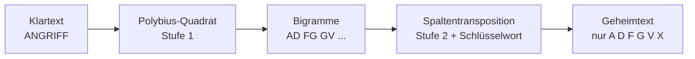
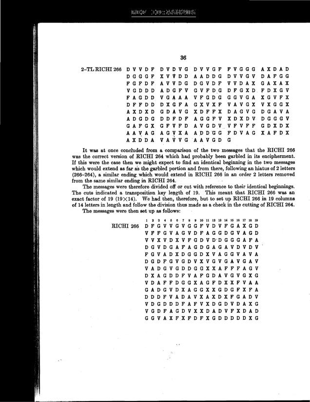
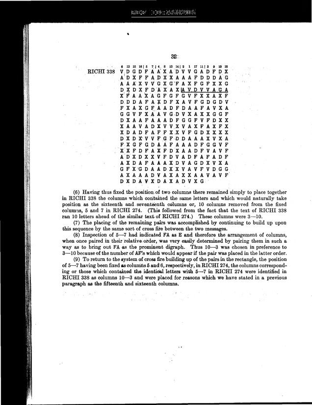

# Handbuch zum ADFGVX-Projekt

Ein Leitfaden für Außenstehende.
Geschrieben nach den Regeln von Wolf Schneider: kurze Sätze, aktive Verben, klare Wörter.

---

## 1. Worum geht es hier?

Im Ersten Weltkrieg verschlüsselte das deutsche Heer seine Funksprüche mit einer Chiffre namens **ADFGVX**.
Der Name besteht aus sechs Buchstaben: A, D, F, G, V, X.
Diese sechs Buchstaben sind die einzigen Zeichen, die im Geheimtext vorkommen.

Viele dieser Funksprüche sind erhalten.
Einige davon hat bis heute niemand entziffert.
Dieses Projekt versucht, sie zu entziffern.

Das klingt nach Kryptanalyse. Ist es aber nur zum Teil.
Die eigentliche Arbeit ist **Datenrekonstruktion**.
Dazu später mehr — das ist die wichtigste Erkenntnis des ganzen Projekts.

---

## 2. Was ist ADFGVX? Eine Chiffre in zwei Stufen

ADFGVX arbeitet in zwei Schritten.
Man muss beide verstehen, sonst versteht man nichts.

### Stufe 1: Das Polybius-Quadrat

Man schreibt ein 6×6-Quadrat.
Darin stehen 26 Buchstaben und 10 Ziffern — also 36 Zeichen.

```
     A  D  F  G  V  X
A    B  C  E  F  G  H
D    I  J  K  L  M  N
F    O  P  Q  R  S  T
G    U  V  W  X  Y  Z
V    0  1  2  3  4  5
X    6  7  8  9  .  /
```

Jedes Klartextzeichen bekommt nun **zwei** Zeilen-/Spaltenbuchstaben.
Aus `B` wird `AA`. Aus `R` wird `FG`. Aus `7` wird `XD`.

So wird der Text doppelt so lang.
Und er besteht nur noch aus sechs Buchstaben.

**Wie entsteht das Quadrat?**
Auf zwei Wegen.

**Weg 1 — aus einem Schlüsselwort bauen.** Doppelte Buchstaben streichen, mit dem Restalphabet auffüllen.
Diese Regel steht in `core/adfgvx.py` als `make_square()`.
Aus `KOMMANDO` wird erst `KOMAND` — das zweite `M` und das zweite `O` fallen weg.
Dann kommt das Restalphabet:

```
K O M A N D B C E F G H I J L P Q R S T U V W X Y Z 0 1 2 3 4 5 6 7 8 9
```

Das Alphabet läuft von `B` bis `9`, aber ohne `K`, `O`, `M`, `A`, `N`, `D`.
Die stehen schon vorn.

Friedman beschreibt genau das.
Das Quadrat sei „in mixed order, often according to some key word" gemischt.
Und er zeigt Beispiele: Ein Quadrat beruht auf `GERMAN MILITARY CIPHERS`, ein anderes auf `XYLOPHONIC BEDLAM`.

**Weg 2 — frei mischen.** Die 36 Zeichen ohne Regel verteilen.
Auch das kam vor.
Friedman schreibt „often" — nicht „immer".

**Was im Projekt steht.** Alle 14 Quadrate in `core/adfgvx.py` sind frei gemischt.
Die Ziffern stehen dort wild verstreut, nicht am Ende.
Beispiel `Nov1-3`:

```
UILOF9RCZVSX02G7QTD8WNB5JMHEKPY41A36
```

Die Ziffern sitzen an den Positionen 5, 12, 13, 15, 19, 23, 31, 32, 34, 35.
Ihre Reihenfolge lautet `9027854136` — kein Muster.

**Warum das Quadrat ein eigenes Geheimnis war.**
Friedman schreibt: „both the checkerboard and the transposition key were changed daily".
Childs bestätigt das für die RICHI-Chiffre: Der Schlüssel hatte eine Lebensdauer von drei Tagen.
Beide Teile wurden also **regelmäßig gewechselt** — Quadrat und Transpositionswort getrennt voneinander.
Wer das Quadrat kennt, hat noch nicht den Spruch.

**Und noch eins:** Diese Regel gilt nur für das Quadrat.
Das Transpositionswort in Stufe 2 wird *nicht* aufgefüllt.
Es bleibt, wie es ist — siehe Abschnitt 7.

### Stufe 2: Die Spaltentransposition

Jetzt kommt ein zweites Schlüsselwort ins Spiel.
Man schreibt die Bigramme zeilenweise unter dieses Wort.
Dann liest man sie spaltenweise wieder heraus — aber in der Reihenfolge des Alphabets der Schlüsselbuchstaben.

Ein Beispiel mit dem Wort `BART`:

```
B  A  R  T     <- Schlüsselwort
1  2  3  4     <- Rang der Buchstaben im Alphabet
```

`A` ist der kleinste Buchstabe, also Rang 1.
`B` ist Rang 2. `R` ist Rang 3. `T` ist Rang 4.

Gelesen wird also Spalte 2, dann Spalte 1, dann Spalte 3, dann Spalte 4.

**Wichtig — und hier stolpern fast alle:**
Die Permutation ist eine **Rangfolge**, keine Lesereihenfolge.
Im Code steht deshalb:

```python
order = sorted(range(n), key=lambda c: perm[c])
```

Wer das verwechselt, bekommt Unsinn. Das Projekt hat genau diesen Fehler dokumentiert.

### Der ganze Weg in einem Bild



Zum Entschlüsseln läuft alles rückwärts.
Man braucht dazu **zwei** Dinge: das Quadrat und das Schlüsselwort.

---

## 3. Was macht dieses Projekt konkret?

Das Projekt sammelt historische ADFGVX-Funksprüche.
Es prüft sie, korrigiert Lesefehler und versucht, sie zu entschlüsseln.

Die Arbeit läuft in vier Schritten:

1. **Sammeln.** Die Geheimtexte stammen aus Büchern und Scans. Sie liegen in `data/corpus.py`.
2. **Prüfen.** Stimmt der Text? Gibt es Lesefehler? Dafür gibt es die Skripte in `analysis/`.
3. **Entschlüsseln.** Verschiedene Löser in `solvers/` suchen Quadrat und Schlüsselwort.
4. **Beweisen.** Ein Ergebnis gilt erst, wenn es sich exakt nachrechnen lässt.

Der Kern des Ganzen liegt in `core/`.
Dort stehen die Chiffre (`adfgvx.py`) und das Sprachmodell (`langmodel.py`).

---

## 4. Die wichtigste Erkenntnis: Das Problem ist die Datenqualität

Das ist der Kernsatz des Projekts:

> **Nicht die Kryptanalyse ist das Problem. Die Daten sind das Problem.**

Die alten Funksprüche wurden von Hand abgeschrieben.
Dann wurden sie gescannt.
Dann hat eine OCR-Software sie gelesen.
Dann hat ein Mensch sie noch einmal abgetippt.

Auf jedem dieser Wege gehen Zeichen verloren oder werden falsch.
Ein `V` wird zu einem `X`. Ein `G` zu einem `F`.
Und schon ist der ganze Spruch unlesbar.

Das Projekt hat das gemessen.
Auf Seite 171 zum Beispiel:

- Der rohe Text hat 314 Zeichen.
- Nur 205 davon — also 65,3 Prozent — passen zum entschlüsselten Klartext.
- Die Editierdistanz beträgt 70: 8 Einfügungen, 4 Löschungen, 58 Ersetzungen.
- Das ist eine Fehlerquote von 22,3 Prozent.

Wer bei so einer Fehlerquote blind nach dem Schlüssel sucht, sucht ewig.
Deshalb dreht das Projekt die Reihenfolge um: **erst die Daten reparieren, dann entschlüsseln.**

---

## 5. Das schärfste Werkzeug: die Konfliktzahl

Das Projekt hat ein Kriterium gefunden, das exakt ist.
Es heißt **Konfliktzahl**.

Die Idee ist einfach.
Wenn Quadrat und Permutation stimmen, dann bildet jedes Bigramm auf **genau ein** Klartextzeichen ab.
Kommt ein Bigramm zweimal vor und liefert zwei verschiedene Zeichen, dann stimmt etwas nicht.

Die Konfliktzahl zählt genau diese Widersprüche.

```python
mapping = defaultdict(Counter)
for bg, ch in zip(bigrams, pt):
    mapping[bg][ch] += 1
conflicts = sum(len(v) - 1 for v in mapping.values())
```

Es gilt:

- `conflicts == 0` bedeutet: Quadrat, Permutation und Geheimtext passen exakt zusammen.
- `conflicts > 0` bedeutet: Mindestens ein Zeichen ist falsch.

Das Projekt hat das geprüft.
Ergebnis: **11 von 11 gelösten Seiten zeigen nach der Korrektur null Konflikte.**
Vorher lagen sie bei 34 bis 107 Konflikten.

Die Konfliktzahl ist also ein Beweis, kein Gefühl.
Aber sie hat einen Haken: Man braucht den Klartext, um sie zu messen.
Für unbekannte Seiten hilft sie erst, wenn man einen Kandidaten hat.

---

## 6. Die Werkzeuge im Einzelnen

### Das Sprachmodell (`core/langmodel.py`)

Das Modell bewertet, wie „deutsch" ein Text aussieht.
Es zählt Einzelbuchstaben, Buchstabenpaare und Buchstabentripel.
Die Häufigkeiten stammen aus `data/de_50k.txt`.

Die Bewertungsskala:

| Textart | Score |
|---|---|
| Echter deutscher Text | −16 bis −21 |
| Zufallstext | −27 bis −32 |
| Lesbarkeitsschwelle | etwa −24 |

Dazu kommt `word_hits()`: Es zählt, wie viele echte Wörter im Text stecken.

**Warnung aus dem Projekt:** Das Trigramm-Modell schadet bei historischem Militärtext mehr, als es nützt.
Die Sprache ist zu eigen. Man sollte es abschalten oder niedrig gewichten.

### Die Löser (`solvers/`)

| Datei | Verfahren |
|---|---|
| `blind_solver.py` | Simulated Annealing über Quadrat und Permutation |
| `sub_solver.py` | Simulated Annealing über das Quadrat, Permutation bekannt |
| `analytic_solver.py` | Häufigkeitsanalyse als Start, dann Hill Climbing |
| `guided_solver.py` | Gezielte Suche mit Abdeckungskriterium |
| `friedman_solver.py` | Struktureller Ansatz nach Friedman |
| `conflict_solver.py` | Sucht Fehler über die Konfliktzahl |
| `reverse_square.py` | Rekonstruiert das Quadrat aus gelösten Texten |

### Die Analyse (`analysis/`)

| Datei | Aufgabe |
|---|---|
| `verify_article_claim.py` | Prüft die Behauptung zu Seite 217 |
| `verify_217.py` | Vollständige Prüfung aller Konventionen für Seite 217 |
| `rank_conflicts.py` | Belegt die Konfliktzahl als exaktes Kriterium |
| `anomaly_scan.py` | Sucht fehlende Zeichen, testet Hypothesen |
| `repair_171.py` | Repariert Seite 171 per Editierdistanz |
| `reconstruct_171.py` | Rekonstruiert Seite 171 |
| `childs_scan.py` | Sucht ungelöste Seiten im Childs-Buch |
| `extract_friedman.py` | Holt Text aus dem Friedman-PDF |

---

## 7. Was das Projekt erreicht hat

### Der Bestand

- 22 Seiten im Korpus (`data/corpus.py`)
- 12 davon gelöst (`data/solutions.py`)
- 10 noch offen
- 14 bekannte Schlüsselwörter (`core/adfgvx.py`)
- 3 Seiten mit Anomalien

### Seite 217 (RICHI-170) — gelöst und bewiesen

Ein Artikel behauptete: „GPT-6 ASTRA SOLVES A WWI GERMAN RADIO".
Das Projekt hat die Behauptung geprüft — und bestätigt.

Das Schlüsselwort lautet `TRUPPENVERSCHIEBUNG`.
Der Klartext beginnt so:

```
EINENGLISCHERKREUZEREINLIEGXSEWASTOPOLXS4STENX
EINGESCHWADERDERXALLIIERTENFOLGT26STENX
```

**Achtung, zwei Dinge nicht verwechseln.**
`TRUPPENVERSCHIEBUNG` ist das **Transpositionswort** (19 Buchstaben), nicht das Quadrat.
Das Quadrat ist eine eigene 6×6-Tabelle und wird separat gebraucht.
Die Auffüllregel aus Abschnitt 2 (`make_square()`) gilt nur für das Quadrat.
Auf `TRUPPENVERSCHIEBUNG` ist sie nicht anwendbar — 19 Buchstaben ergeben kein 36-Zeichen-Quadrat.
Genau diese Verwechslung war ein früherer Denkfehler des Projekts.

Drei Tests laufen durch:

1. **Transposition:** Rang 16 (das `T`) beginnt beim 135. Zeichen. Dort steht ein `A`. Stimmt.
2. **Substitution:** Null Konflikte. Das Quadrat ist widerspruchsfrei.
3. **Roundtrip:** Verschlüsselt man den Klartext neu, kommt exakt der Geheimtext heraus.

**Wichtig:** Eine frühere „Widerlegung" im Projekt war ein Denkfehler.
Der Fehler lag in der Rangfolge der Permutation. Siehe Abschnitt 2.

### RICHI-274 und RICHI-338 — gelöst

Beide Seiten nutzen den Schlüssel `Oct28-31`.
Die Permutation ist `[6,15,12,16,5,7,14,4,13,8,11,1,17,2,10,3,18,9]`.
Die Tabellen stehen in `data/childs_additional.py`.

### RICHI-240 — teilweise

Von 240 Zeichen fehlen 20.
Die Ziffern 7, 9 und 6 stammen aus einem französischen Telegramm.

---

## 8. Die Sackgassen — und was sie gelehrt haben

Ein ehrliches Handbuch verschweigt die Irrwege nicht.
Dieses Projekt hat viele davon dokumentiert.

| Sackgasse | Lehre |
|---|---|
| Trigramm-Modell als Hauptkriterium | Schadet bei historischem Militärtext |
| Nur `word_hits` als Fitness | Erzeugt Plateaus, die Suche bleibt stehen |
| Greedy-Alignment | Fehlerhaft. Editierdistanz benutzen |
| Blinde Suche nach Quadrat und Permutation | Löst das falsche Problem — die Schlüssel sind meist bekannt |
| Anomalie-Reparatur | War ein Artefakt. Gelöste Seiten zeigen größere Abweichungen |
| Seite 170 als „einziger Astra-Kandidat" | Falsch. Nur 106 statt 240 Zeichen |

Die wichtigste Lehre steht schon in Abschnitt 4:
**Erst die Daten, dann die Krypto.**

---

## 9. Wie man den Code benutzt

Alle Skripte sind Python 3.
Man startet sie aus dem Projektverzeichnis.

```bash
cd /home/user/Projekte/adfgvx

# Chiffre testen
python3 -c "import bootstrap; from core.adfgvx import *; print(KEYS.keys())"

# Seite 217 verifizieren
python3 analysis/verify_article_claim.py

# Alle gelösten Seiten prüfen
python3 analysis/verify_solutions.py

# Konfliktzahl als Kriterium belegen
python3 analysis/rank_conflicts.py

# Tests laufen lassen
python3 tests/testcases.py
python3 tests/test_171.py
```

`bootstrap.py` setzt den Projektpfad auf `sys.path`.
Man muss es nur einmal importieren.

---

## 10. Die Quellen

Das Projekt stützt sich auf historisches Material.
Die Dateien liegen in `docs/`.

### Friedmans Lehrbuch

William F. Friedman: *Military Cryptanalysis, Part IV*.
Das PDF liegt als `docs/41761079080022.pdf`.
Der relevante Abschnitt ist als Text in `docs/friedman_section_IX.txt` gespeichert.

### Die Schlüsselliste

Die bekannten ADFGVX-Schlüssel stammen aus einer Liste von Lasry.
Sie liegt als `docs/adfgvx_keys.pdf`.

### Die Quadrate

Die Quadrate stehen als Tabelle in den Quellen — nicht als Schlüsselwort.
Ein Beispiel: das Quadrat für den 1.–3. November.
Es steht in `docs/childs_book.pdf` auf der gedruckten Seite 44 (PDF-Seite 52).
Dort heißt es schlicht „ADFGVX KEY FOR NOVEMBER 1, 2, AND 3".

```
     A  D  F  G  V  X
A    U  I  L  O  F  9
D    R  C  Z  V  S  X
F    0  2  G  7  Q  T
G    D  8  W  N  B  5
V    J  M  H  E  K  P
X    Y  4  1  A  3  6
```

Kein Schlüsselwort, keine Auffüllregel.
Die 36 Zeichen sind frei gemischt.
Genau so steht es auch in `core/adfgvx.py` unter `Nov1-3`.

Das ist ein Einzelfall, kein Beweis.
Friedman zeigt an anderen Stellen Quadrate, die sehr wohl aus einem Schlüsselwort stammen.
Wer wissen will, wie das geht, liest Abschnitt 2.

**Ein Hinweis zur Quelle.** Der Scan ist alt und die automatische Texterkennung
verwechselt `O` und `0` leicht. Im Quadrat für den 1.–3. November steht in der
ersten Zeile ein `O` (Buchstabe), in der dritten Zeile eine `0` (Ziffer).
Wer die Tabelle aus dem PDF ausliest, muss das prüfen — sonst wird aus
`STOERUNG` schnell `ST0ERUNG`.

### Das Childs-Buch

Ein Buch mit abgedruckten Funksprüchen.
Es liegt als PDF (`docs/childs_book.pdf`) und als OCR-Text (`docs/childs_djvu.txt`) vor.

Die einzelnen Seiten sind als Bilder gescannt.
Sie liegen in `docs/childs_pages/` — 63 JPG-Dateien von `page_00.jpg` bis `page_62.jpg`.

**Achtung, zwei verschiedene Zählungen.**
Die JPG-Dateien sind nach PDF-Seiten nummeriert, nicht nach gedruckten Seitenzahlen.
Es gilt: `page_NN.jpg` = PDF-Seite `NN + 1`.
Die gedruckte Seitenzahl im Buch liegt um 8 niedriger als die PDF-Seite.
Der Grund ist das Vorwort: acht Seiten vornweg.

| Nachricht | gedruckte Seite | PDF-Seite | Bilddatei |
|---|---|---|---|
| RICHI 266 | 36 | 44 | `page_43.jpg` |
| RICHI 338 | 32 | 40 | `page_39.jpg` |

**RICHI 266** (gedruckte Seite 36, PDF-Seite 44):



**RICHI 338** (gedruckte Seite 32, PDF-Seite 40):



Die zugehörigen Transkriptionen stehen in `docs/childs_pages/266.md` und `docs/childs_pages/338.md`.

Ein Prüfbericht über die Scans liegt in `docs/childs_scan_report.txt`.

### Der Kommentar-Entwurf

Ein Entwurf für einen Kommentar auf Cipherbrain liegt in `docs/cipherbrain_kommentar_entwurf.md`.

---

## 11. Die Regeln dieses Handbuchs

Dieses Handbuch folgt Wolf Schneider.
Was heißt das konkret?

- **Kurze Sätze.** Ein Gedanke pro Satz.
- **Aktiv statt Passiv.** „Das Projekt prüft" statt „Es wird geprüft".
- **Konkrete Verben.** „messen", „zählen", „reparieren" — nicht „vornehmen", „durchführen".
- **Kein Nominalstil.** „Wir prüfen" statt „Die Durchführung der Prüfung".
- **Keine Füllwörter.** Kein „eigentlich", „gewissermaßen", „sozusagen".
- **Klare Wörter.** Kein Fachjargon ohne Erklärung.
- **Ein Bild pro Abschnitt.** Wo es hilft, nicht wo es schmückt.

Wer das befolgt, schreibt verständlich.
Und darum geht es hier: Ein Außenstehender soll verstehen, was passiert.

---

## 12. Kurzfassung

1. ADFGVX ist eine Chiffre in zwei Stufen: Quadrat, dann Transposition.
2. Das Projekt entziffert alte deutsche Funksprüche.
3. Das größte Problem sind Lesefehler, nicht die Krypto.
4. Die Konfliktzahl ist ein exakter Beweis für ein richtiges Ergebnis.
5. 12 von 22 Seiten sind gelöst.
6. Seite 217 ist mit `TRUPPENVERSCHIEBUNG` bewiesen.
7. Erst die Daten reparieren, dann entschlüsseln.
